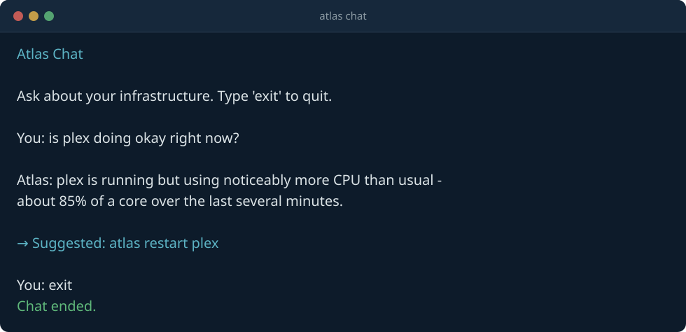

<p align="center">
  
</p>

<p align="center">
  <a href="https://github.com/Cyb3rRon1n/atlas/actions/workflows/ci.yml"></a>
  <a href="LICENSE"></a>
  
</p>

# Atlas

**Know what's running on your infrastructure, why, and what changed — before you have to go find out the hard way.**

Atlas is a CLI built for people running real infrastructure at home — Proxmox clusters, Docker containers, and the self-hosted services on top of them — who are tired of learning something broke by noticing it's down. Run it locally, alongside whatever you're managing, whenever you want a read on things: it discovers what's actually there, remembers what changed since last time, and can explain either in plain language, via Claude or a fully local Ollama model. Nothing it tells you is guessed — every AI-suggested action is checked against what Atlas actually observed first.

When it comes to acting — restarting a container, resizing its limits, restarting a Proxmox guest — Atlas always asks first. No daemon, no autonomous mode, no bypass flag.

Everything above is real and working today. See [Project Status](#project-status) for what's shipped and verified against real infrastructure, not mocks.

---

## Project Status

Atlas has a working CLI covering discovery, Docker and Proxmox integration, AI-assisted analysis, and approval-gated automation — and it's been verified against real infrastructure, not just tests. See the [Roadmap](https://cyb3rron1n.github.io/atlas/roadmap/) for the full, detailed history, including real bugs found and fixed along the way.

### Shipped and verified against real infrastructure

- ✅ Hardware, OS, storage, and network discovery
- ✅ Docker discovery, service detection, and Compose analysis
- ✅ Docker container restart, stop, and resize (CPU/memory limits) — approval-gated actions backed by a real `atlas/actions/` registry
- ✅ Container resource-allocation visibility — per-container CPU/memory usage relative to its own configured limit, not just relative to the host
- ✅ Proxmox cluster discovery, change detection, and guest restart/stop/resize (CPU/memory limits) — the same three actions Docker containers have
- ✅ AI analysis via a local Ollama model end to end; Anthropic Claude also supported (connection and error handling verified, a full response is pending your own billing setup)
- ✅ Agent-based capabilities — both providers can call read-only tools mid-request for live state; `atlas analyze` uses this by default, and it powers the new `atlas chat` command
- ✅ Multi-step action plans — an ordered sequence of approval-gated actions for genuinely dependent steps (e.g. stop one container, then restart another), which Atlas can run for you step by step, each with its own confirmation
- ✅ Persisted `atlas chat` transcripts — a session's conversation saves as one event on exit, visible via `atlas history`
- ✅ `get_container_logs` tool — lets both AI providers pull recent log lines for a specific container instead of reasoning from status alone
- ✅ Prometheus monitoring — host and per-container (cAdvisor) metrics, configurable threshold alerting, and change detection between scans
- ✅ Resource-usage trending (`atlas trends`) — latest/min/max/avg over time for host, per-container, and per-Proxmox-guest metrics, built from the history `atlas monitor`/`atlas proxmox scan` already save
- ✅ Guided setup (`atlas init`) and environment/integration health checks (`atlas doctor`)
- ✅ `--json` output and cron-friendly exit codes on `atlas doctor`/`atlas monitor`/`atlas trends` — wire either health check into your own cron job or systemd timer without Atlas becoming a daemon
- ✅ Event-driven architecture with persistent operational history
- ✅ Plugin architecture

### Next

Nothing currently in progress, but a real, non-empty backlog exists — see the [Roadmap](https://cyb3rron1n.github.io/atlas/roadmap/#next)'s own checklist for exactly what's queued (a fifth action type, a second plugin type, multi-node/fleet support, a read-only web view, and a fully successful Anthropic response pending your own billing setup) versus deliberately out of scope (no daemon, no push notifications, no unattended automation).

---

## Requirements & Platform Support

Atlas itself needs very little. Everything past the base install is an optional integration, independently gated by config, and `atlas doctor` will tell you exactly what's configured versus missing.

**To run Atlas at all:** Linux, Python 3.11+, and pip. That's enough for `atlas discover`, `atlas report`, `atlas docker`, `atlas services`, `atlas compose`, and `atlas doctor` — no config file, no external services.

**Optional — only needed for the specific integration it backs:**

| Integration | Enables | What it actually needs |
|---|---|---|
| Docker | Container discovery, `atlas restart`/`stop`/`resize`, cAdvisor container metrics | A Docker daemon reachable from wherever Atlas runs — the local socket by default, or `DOCKER_HOST` for a remote one |
| Proxmox VE | `atlas proxmox scan`/`restart` | A reachable Proxmox host and an API token — a network call over HTTPS, nothing installed on the Proxmox host itself. See [Deployment](https://cyb3rron1n.github.io/atlas/deployment/) for the recommended (not required) topology |
| Anthropic **or** Ollama | `atlas analyze`, `atlas chat` | An `ANTHROPIC_API_KEY`, or a locally-reachable Ollama instance — only one is needed |
| Prometheus | `atlas monitor` | An existing Prometheus, [`node_exporter`](https://github.com/prometheus/node_exporter) for host metrics, and [cAdvisor](https://github.com/google/cadvisor) if you also want per-container metrics |

None of the above is required to get started — see [Quick Start](#quick-start).

**Platform support** — "verified" means run against real infrastructure, not just unit-tested against mocks (see the [Roadmap](https://cyb3rron1n.github.io/atlas/roadmap/) for what each verification covered):

| Platform | Status |
|---|---|
| Ubuntu | ✅ verified — CI runs the full test suite on real `ubuntu-latest` GitHub Actions runners (Python 3.11/3.12) |
| Fedora | ✅ verified — this project's actual development environment throughout, including every real-infrastructure check in this doc (Docker actions, Proxmox, Prometheus/cAdvisor, Ollama), plus a `btrfs`-rooted filesystem discovery correctly handles that Ubuntu's ext4-default setup never exercised |
| Other Linux distros (Debian, Arch, RHEL, ...) | best-effort — no distro-specific code, but not independently run |
| macOS / Windows | out of scope — `pyproject.toml` classifies POSIX/Linux only |

| Integration | Status |
|---|---|
| Docker | ✅ verified against real containers |
| Proxmox VE | ✅ verified against a real Proxmox VE host |
| Ollama | ✅ verified against a real local `llama3.1` |
| Anthropic | ◐ partially verified — auth and error handling confirmed; a full response is pending the maintainer's own billing setup |
| Prometheus + node_exporter + cAdvisor | ✅ verified against real infrastructure |

---

## Quick Start

Clone the repository and set up a virtual environment:

```bash
git clone https://github.com/Cyb3rRon1n/atlas.git
cd atlas

python -m venv .venv
source .venv/bin/activate

pip install -e .
atlas version
```

Generate `atlas.yaml` interactively (optional — Atlas runs on safe defaults without one):

```bash
atlas init
```

Run a first discovery pass and inspect the results:

```bash
atlas discover   # inventories the host and saves it to inventory/generated/
atlas report     # generates a report from the latest inventory
atlas analyze    # sends the latest snapshot to an AI provider for a summary + recommendations
atlas chat       # ask Atlas about your infrastructure directly - no atlas discover needed first
```

---

## Screenshots

Representative output, not a literal capture — field names and formatting match real commands; hostnames, containers, and figures are illustrative.

<p align="center">
  <br>
  <sub><code>atlas doctor</code> — environment health plus integration readiness</sub>
</p>

<p align="center">
  <br>
  <sub><code>atlas proxmox scan</code> — cluster inventory and change detection since the last scan</sub>
</p>

<p align="center">
  <br>
  <sub><code>atlas analyze</code> — AI summary with a grounded, approval-gated action suggestion</sub>
</p>

<p align="center">
  <br>
  <sub><code>atlas chat</code> — a live conversation, grounded the same way as <code>atlas analyze</code></sub>
</p>

More examples (monitoring, resource-usage trends, multi-step plans) are on the [docs site](https://cyb3rron1n.github.io/atlas/).

---

## CLI Reference

| Command | Description |
|---|---|
| `atlas version` | Display the Atlas version. |
| `atlas status` | Display current Atlas status. |
| `atlas doctor` | Run Atlas health checks, including readiness of Proxmox/AI/Prometheus integrations. `--json` for machine-readable output; exits 1 if anything's unhealthy. |
| `atlas init` | Interactively generate `atlas.yaml`, logging the session to `logs/`. |
| `atlas config` | Display the active Atlas configuration. |
| `atlas discover` | Discover infrastructure information (including registered plugins) and generate inventory. |
| `atlas report` | Generate an infrastructure report from the latest inventory. |
| `atlas docker` | Display Docker container status. |
| `atlas restart <name>` | Restart a Docker container. Prompts for confirmation before acting. |
| `atlas stop <name>` | Stop a Docker container without removing it. Prompts for confirmation before acting. |
| `atlas resize <name>` | Resize a Docker container's CPU (`--cpus`) and/or memory (`--memory`) limit, live, without a restart. Prompts for confirmation before acting. |
| `atlas services` | Detect known self-hosted services running in Docker. |
| `atlas compose` | Analyze a Docker Compose file. |
| `atlas proxmox scan` | Scan Proxmox infrastructure and report changes since the last scan (requires `proxmox.enabled: true`). |
| `atlas proxmox restart <vmid>` | Restart a Proxmox VM or LXC guest. Prompts for confirmation before acting. |
| `atlas proxmox stop <vmid>` | Shut down a Proxmox VM or LXC guest (ACPI request). Prompts for confirmation before acting. |
| `atlas proxmox resize <vmid>` | Resize a Proxmox guest's CPU (`--cpus`) and/or memory (`--memory`) limit. Prompts for confirmation before acting. |
| `atlas monitor` | Query Prometheus for host metrics and flag any at or above their configured threshold (requires `monitoring.enabled: true`). `--json` for machine-readable output; exits 1 if anything's exceeded or Prometheus is unreachable. |
| `atlas trends` | Show host, per-container, and per-Proxmox-guest resource-usage trends from saved `atlas monitor`/`atlas proxmox scan` snapshots. `--json` for machine-readable output. |
| `atlas plugins` | Display registered Atlas plugins. |
| `atlas history` | Display recorded operational events. |
| `atlas intelligence` | Display the latest stored environment context. |
| `atlas analyze` | Analyze the latest environment snapshot with AI (using live tool calls for current state) and print a summary plus recommendations. |
| `atlas chat` | Interactive multi-turn chat with Atlas about your infrastructure — no prior `atlas discover` required. Type `exit` to quit. |
| `atlas runtime` | Display Atlas runtime information. |

Run `atlas <command> --help` for command-specific options.

---

## Features

**Guided Setup** — `atlas init` walks you through only what actually varies per deployment (name, Proxmox, AI provider, Prometheus), shows a full review screen before writing anything, and logs the session (secrets redacted) to `logs/`. `ANTHROPIC_API_KEY` is never prompted for or written to disk.

**Health Checks** — `atlas doctor` checks your environment (Python, memory, storage, Docker) and whether each optional integration is actually configured. Fast presence checks, not live connection attempts, so it never hangs.

**Infrastructure Discovery** — `atlas discover` inventories the host — OS, hardware, storage, network — and saves it for reporting, analysis, and change detection.

**Docker Integration** — `atlas docker` inspects containers; `atlas services` recognizes known self-hosted services running in them (Plex, Sonarr, and more — see the [Service Catalog](https://cyb3rron1n.github.io/atlas/service-catalog/)). Atlas can also act: `atlas restart`/`stop`/`resize <name>`, always after showing current state and asking for confirmation.

**Docker Compose Analysis** — `atlas compose` parses a Compose file to surface its services, images, ports, and volumes.

**Proxmox Integration** — `atlas proxmox scan` inventories a cluster (nodes, VMs, containers) and reports what changed since the last scan. Atlas can also act: `atlas proxmox restart`/`stop`/`resize <vmid>` — the same three actions Docker containers have, always after showing current state and asking for confirmation. Token-based auth is recommended — see [Configuration](#configuration).

**Monitoring** — `atlas monitor` queries an existing Prometheus for host and per-container metrics (via `node_exporter`/cAdvisor), flags anything over a configurable threshold, and reports what changed since the last scan. `atlas trends` shows how those metrics moved over time — host, per-container, and per-Proxmox-guest — built entirely from history `atlas monitor`/`atlas proxmox scan` already save, no new collection or storage. Disabled by default.

**Plugin Architecture** — new discovery/integration capabilities register through a plugin system (`atlas plugins`) without touching the core.

**Operational Memory** — every meaningful action publishes an event onto an internal bus and is persisted automatically — `atlas history` shows the full record: discoveries, scans, restarts, chat sessions, and more.

**AI Analysis Engine** — `atlas analyze` sends your latest environment snapshot to Claude or a local Ollama model and gets back a plain-language summary plus concrete recommendations. See [Configuration](#configuration) for provider setup.

**Agent-Based Capabilities** — both providers can call a small, read-only tool set mid-request (containers, services, Proxmox status, metrics, logs, recent history) instead of only ever seeing one fixed snapshot. This powers `atlas chat`, an interactive command that needs no prior `atlas discover`. Either command can suggest an approval-gated action, or a multi-step **plan** for genuinely dependent steps (stop this, then restart that) — always grounded against what Atlas actually observed, and after printing, both offer to run it for you: each step still gets its own confirmation, and a declined or failed step stops the rest of the plan.

---

## Architecture

Atlas is built around a modular, event-driven core (CLI → Runtime → Plugins / Event Bus / Knowledge Store), designed so new capabilities plug in without rewriting existing ones. See the [Architecture docs](https://cyb3rron1n.github.io/atlas/architecture/) for the full picture, including how every integration and approval-gated action fits together.

---

## Configuration

Atlas uses YAML configuration, loaded from `atlas.yaml` in the working directory:

```yaml
name: sentinel

discovery:
  hardware: true
  storage: true
  network: true

inventory:
  directory: inventory/generated

proxmox:
  enabled: true
  host: 192.168.1.10
  user: atlas@pve
  token_name: atlas-token   # preferred: a scoped API token generated in the Proxmox UI
  token_value: ""
  # password: ""            # fallback if not using a token
  verify_ssl: false

intelligence:
  provider: anthropic   # or "ollama"
  model: claude-opus-5  # or an Ollama model name, e.g. llama3.1
  ollama_host: http://localhost:11434
```

The Anthropic provider reads its API key from the `ANTHROPIC_API_KEY` environment variable — it is never stored in `atlas.yaml`. For Proxmox, prefer a scoped API token over the account password: create one in the Proxmox UI under **Datacenter → Permissions → API Tokens**, and grant it only the privileges Atlas needs (read access is enough for `atlas proxmox scan`).

---

## Documentation

The full documentation site — architecture, CLI reference, configuration reference, deployment model, service catalog, and roadmap — is live at **[cyb3rron1n.github.io/atlas](https://cyb3rron1n.github.io/atlas/)**, built from [`docs/`](docs/) with [MkDocs Material](https://squidfunk.github.io/mkdocs-material/).

To browse it locally, or after editing a page:

```bash
pip install -e ".[docs]"
mkdocs serve
```

Redeploying the live site is manual (`.github/workflows/docs.yml`, triggered via `gh workflow run docs.yml` or the Actions tab) rather than automatic on every push, so a docs edit doesn't go live until you choose to publish it.

---

## Contributing

Contributions, ideas, and discussions are welcome. Please read [`CONTRIBUTING.md`](CONTRIBUTING.md) before submitting changes.

## Security

Security issues should be reported according to [`SECURITY.md`](SECURITY.md).

## License

Atlas is released under the [MIT License](LICENSE).

---

## Vision

Atlas's long-term goal: observe → understand → recommend → automate → optimize, with every step staying observable, explainable, and under your control.
