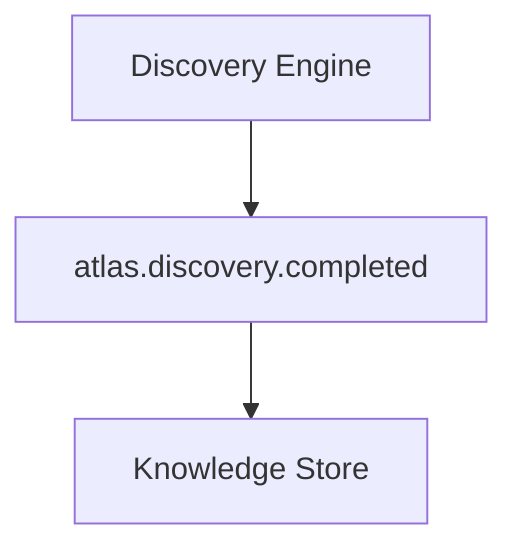
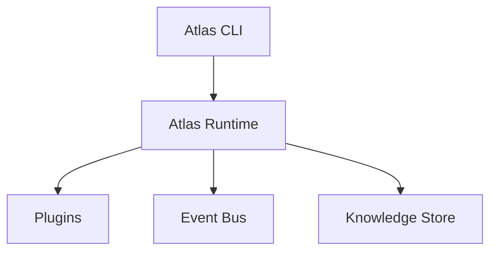
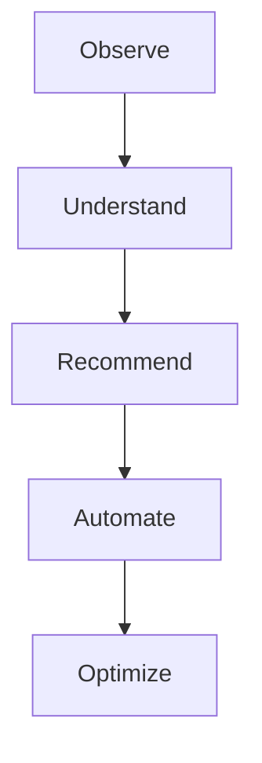

<p align="center">
  
</p>

# Atlas

**AI-powered operations platform for self-hosted infrastructure.**

Atlas is an extensible infrastructure intelligence platform designed to discover, understand, and eventually automate self-hosted environments. It provides a unified operational layer for homelabs, private clouds, and self-managed infrastructure by combining:

- Infrastructure discovery
- Operational inventory
- Service awareness
- Event-driven architecture
- Persistent infrastructure knowledge
- Plugin-based extensibility
- AI-assisted operations

Atlas is currently under active development.

---

## Project Status

Atlas is progressing through its foundation and intelligence architecture phases.

### Implemented

- ✅ Python CLI application
- ✅ Configuration management
- ✅ Hardware, OS, storage, and network discovery
- ✅ Inventory generation
- ✅ Reporting engine
- ✅ Docker discovery and service detection
- ✅ Docker Compose analysis
- ✅ Proxmox integration foundation
- ✅ Plugin architecture
- ✅ Event-driven system
- ✅ Persistent operational history and knowledge storage
- ✅ AI analysis engine (pluggable Anthropic / Ollama providers)

### In Development

- 🚧 Automated operational workflows
- 🚧 Agent-based capabilities
- 🚧 Advanced monitoring integrations

---

## Quick Start

Clone the repository and set up a virtual environment:

```bash
git clone https://github.com/Cyb3rRon1n/atlas.git
cd atlas

python -m venv .venv
source .venv/bin/activate

pip install -e .
atlas version
```

Generate `atlas.yaml` interactively (optional — Atlas runs on safe defaults without one):

```bash
atlas init
```

Run a first discovery pass and inspect the results:

```bash
atlas discover   # inventories the host and saves it to inventory/generated/
atlas report     # generates a report from the latest inventory
atlas analyze    # sends the latest snapshot to an AI provider for a summary + recommendations
```

---

## Screenshots

Representative output, not a literal capture — field names and formatting match real commands; hostnames, containers, and figures are illustrative.

<p align="center">
  <br>
  <sub><code>atlas doctor</code> — environment health plus integration readiness</sub>
</p>

<p align="center">
  <br>
  <sub><code>atlas proxmox scan</code> — cluster inventory and change detection since the last scan</sub>
</p>

<p align="center">
  <br>
  <sub><code>atlas analyze</code> — AI summary with a grounded, approval-gated action suggestion</sub>
</p>

---

## CLI Reference

| Command | Description |
|---|---|
| `atlas version` | Display the Atlas version. |
| `atlas status` | Display current Atlas status. |
| `atlas doctor` | Run Atlas health checks, including readiness of Proxmox/AI/Prometheus integrations. |
| `atlas init` | Interactively generate `atlas.yaml`, logging the session to `logs/`. |
| `atlas config` | Display the active Atlas configuration. |
| `atlas discover` | Discover infrastructure information (including registered plugins) and generate inventory. |
| `atlas report` | Generate an infrastructure report from the latest inventory. |
| `atlas docker` | Display Docker container status. |
| `atlas restart <name>` | Restart a Docker container. Prompts for confirmation before acting. |
| `atlas services` | Detect known homelab services running in Docker. |
| `atlas compose` | Analyze a Docker Compose file. |
| `atlas proxmox scan` | Scan Proxmox infrastructure and report changes since the last scan (requires `proxmox.enabled: true`). |
| `atlas proxmox restart <vmid>` | Restart a Proxmox VM or LXC guest. Prompts for confirmation before acting. |
| `atlas monitor` | Query Prometheus for host metrics (requires `monitoring.enabled: true`). |
| `atlas plugins` | Display registered Atlas plugins. |
| `atlas history` | Display recorded operational events. |
| `atlas intelligence` | Display the latest stored environment context. |
| `atlas analyze` | Analyze the latest environment snapshot with AI and print a summary plus recommendations. |
| `atlas runtime` | Display Atlas runtime information. |

Run `atlas <command> --help` for command-specific options.

---

## Features

### Infrastructure Discovery

Atlas inspects the host system and generates a structured infrastructure inventory covering host information, OS details, CPU and memory, storage devices and filesystem usage, and network information. Discovered data is saved to `inventory/generated/system-inventory.yaml` (`atlas discover`) and feeds reporting, analysis, change detection, and future automation.

### Docker Integration

Atlas inspects Docker environments — containers, images, status, and IDs (`atlas docker`) — and can identify known homelab services running inside them (`atlas services`), for example:

```
Atlas Services

Service:  Plex
Category: Media
Container: plex
Status:   running
```

Atlas can also act, not just observe: `atlas restart <name>` restarts a container after showing you its current state and asking for confirmation. This is Atlas's first automation capability — see [Deployment](https://cyb3rron1n.github.io/atlas/deployment/) for the safety principle behind approval-gated actions.

### Docker Compose Analysis

Atlas can parse a Docker Compose file (`atlas compose`) to surface its services, images, ports, and volumes.

### Proxmox Integration

Atlas can connect to a Proxmox cluster and inventory it (`atlas proxmox scan`): node status, and every VM and container across the cluster (name, node, status, CPU/memory usage). Authentication supports either an API token (`token_name`/`token_value`, recommended — see [Configuration](#configuration)) or a password. Results feed into the same environment context as `atlas discover`, so `atlas analyze` can reason about your virtualization layer too. Each scan also reports what changed since the last one — nodes or guests added, removed, or with a different status. Atlas can also act here, not just observe: `atlas proxmox restart <vmid>` restarts a VM or LXC guest after showing you its current state and asking for confirmation, the same approval-gated shape as `atlas restart` for Docker — see [Architecture](https://cyb3rron1n.github.io/atlas/architecture/#approval-gated-actions). This needs write/power-management permission on the token beyond the read-only scope `scan` uses. Planned expansion includes resource-usage trending over time.

### Monitoring

Atlas can query an existing [Prometheus](https://prometheus.io/) server for host metrics (`atlas monitor`) — CPU, memory, and disk usage, via the standard [`node_exporter`](https://github.com/prometheus/node_exporter) metrics. Like the rest of Atlas's integrations, it's Atlas reaching out on command, not a `/metrics` endpoint you'd point Prometheus at. If Prometheus is reachable but a given exporter isn't set up yet, the affected metric reports as unavailable rather than failing the whole scan. Disabled by default — see [Configuration](#configuration).

### Plugin Architecture

Atlas uses a plugin-based design so new discovery providers, infrastructure integrations, monitoring systems, and automation capabilities can be added without rewriting the core system. The current plugin system supports registration, discovery, initialization, and plugin-level events (`atlas plugins`):

```
Atlas Plugins

Docker (0.1.0)
```

### Event System

Atlas uses an internal event bus so components can communicate without direct dependencies:



Current events include `atlas.plugin.loaded`, `atlas.discovery.completed`, and `atlas.analysis.completed`.

### Operational Memory

Atlas maintains persistent operational history — plugin events, discovery events, and infrastructure observations — as the foundation for its intelligence features (`atlas history`).

### AI Analysis Engine

Atlas can send its latest discovered environment snapshot to a configurable AI provider and get back a plain-language summary plus concrete, actionable recommendations (`atlas analyze`). The provider is pluggable:

- **Anthropic** — Claude models via the official SDK, using structured outputs so responses are always valid.
- **Ollama** — any locally-run model, for a fully self-hosted setup.

See [Configuration](#configuration) below for how to select and configure a provider. Results are persisted to Atlas's knowledge store and emit an `atlas.analysis.completed` event.

---

## Architecture

Atlas is built around a modular event-driven architecture, designed to let new capabilities be added without rewriting the core system:



---

## Configuration

Atlas uses YAML configuration, loaded from `atlas.yaml` in the working directory:

```yaml
name: sentinel

discovery:
  hardware: true
  storage: true
  network: true

inventory:
  directory: inventory/generated

proxmox:
  enabled: true
  host: 192.168.1.10
  user: atlas@pve
  token_name: atlas-token   # preferred: a scoped API token generated in the Proxmox UI
  token_value: ""
  # password: ""            # fallback if not using a token
  verify_ssl: false

intelligence:
  provider: anthropic   # or "ollama"
  model: claude-opus-5  # or an Ollama model name, e.g. llama3.1
  ollama_host: http://localhost:11434
```

The Anthropic provider reads its API key from the `ANTHROPIC_API_KEY` environment variable — it is never stored in `atlas.yaml`. For Proxmox, prefer a scoped API token over the account password: create one in the Proxmox UI under **Datacenter → Permissions → API Tokens**, and grant it only the privileges Atlas needs (read access is enough for `atlas proxmox scan`).

---

## Documentation

The full documentation site — architecture, CLI reference, configuration reference, deployment model, service catalog, and roadmap — is live at **[cyb3rron1n.github.io/atlas](https://cyb3rron1n.github.io/atlas/)**, built from [`docs/`](docs/) with [MkDocs Material](https://squidfunk.github.io/mkdocs-material/).

To browse it locally, or after editing a page:

```bash
pip install -e ".[docs]"
mkdocs serve
```

Redeploying the live site is manual (`.github/workflows/docs.yml`, triggered via `gh workflow run docs.yml` or the Actions tab) rather than automatic on every push, so a docs edit doesn't go live until you choose to publish it.

---

## Development

Atlas development follows incremental milestones. Current priorities, in order:

1. Core architecture
2. Discovery framework
3. Plugin ecosystem
4. Operational memory
5. Intelligence layer
6. Automation framework

---

## Contributing

Contributions, ideas, and discussions are welcome. Please read [`CONTRIBUTING.md`](CONTRIBUTING.md) before submitting changes.

## Security

Security issues should be reported according to [`SECURITY.md`](SECURITY.md).

## License

Atlas is released under the [MIT License](LICENSE).

---

## Vision

Atlas aims to become an intelligent operations platform for self-hosted infrastructure:



Atlas is being built as a foundation for infrastructure intelligence.
