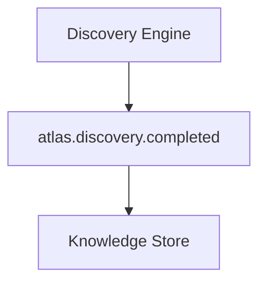
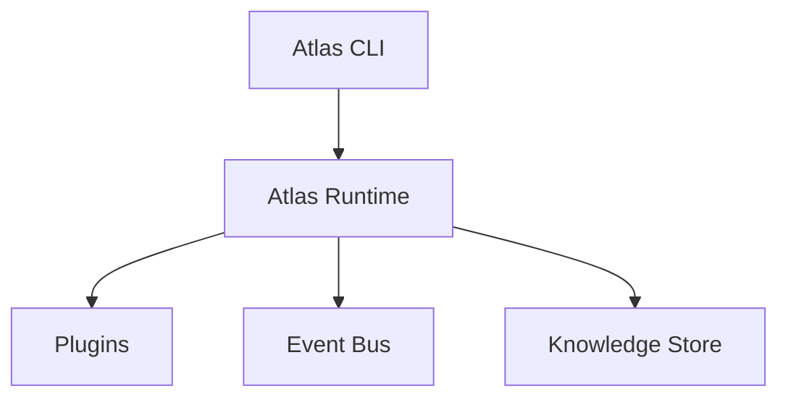
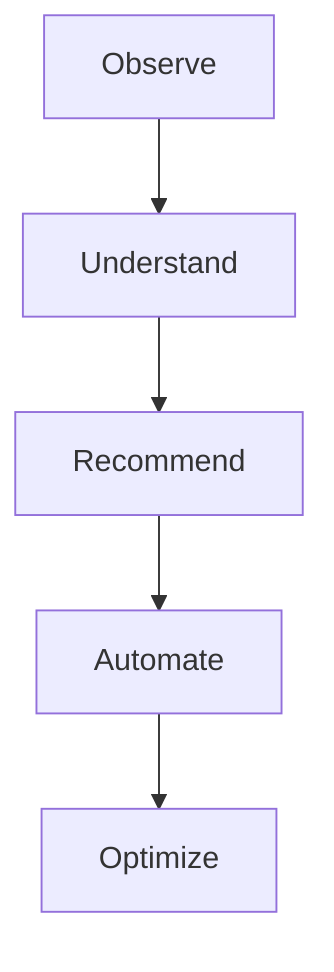

<p align="center">
  
</p>

<p align="center">
  <a href="https://github.com/Cyb3rRon1n/atlas/actions/workflows/ci.yml"></a>
  <a href="LICENSE"></a>
  
</p>

# Atlas

**Know what's running on your infrastructure, why, and what changed — before you have to go find out the hard way.**

Atlas is a CLI that discovers, remembers, and explains self-hosted infrastructure: Proxmox clusters, Docker containers, and the services running on them. Ask what changed since your last check-in, or get an AI-generated summary via Claude or a fully local Ollama model — either way, nothing it tells you is guessed. Every AI-suggested action is checked against what Atlas actually observed first.

When it comes to acting — restarting a container, restarting a Proxmox guest — Atlas always asks first. No autonomous mode, no bypass flag.

Everything above is real and working today. See [Project Status](#project-status) for what's shipped and verified against real infrastructure, not mocks.

---

## Project Status

Atlas has a working CLI covering discovery, Docker and Proxmox integration, AI-assisted analysis, and approval-gated automation — and it's been verified against real infrastructure, not just tests. See the [Roadmap](https://cyb3rron1n.github.io/atlas/roadmap/) for the full, detailed history, including real bugs found and fixed along the way.

### Shipped and verified against real infrastructure

- ✅ Hardware, OS, storage, and network discovery
- ✅ Docker discovery, service detection, and Compose analysis
- ✅ Docker container restart and stop — approval-gated actions backed by a real `atlas/actions/` registry
- ✅ Proxmox cluster discovery, change detection, and guest restart
- ✅ AI analysis via a local Ollama model end to end; Anthropic Claude also supported (connection and error handling verified, a full response is pending your own billing setup)
- ✅ Agent-based capabilities — both providers can call read-only tools mid-request for live state; `atlas analyze` uses this by default, and it powers the new `atlas chat` command
- ✅ Prometheus monitoring — host and per-container (cAdvisor) metrics, configurable threshold alerting, and change detection between scans
- ✅ Guided setup (`atlas init`) and environment/integration health checks (`atlas doctor`)
- ✅ Event-driven architecture with persistent operational history
- ✅ Plugin architecture

### In progress

- Nothing currently queued

---

## Quick Start

Clone the repository and set up a virtual environment:

```bash
git clone https://github.com/Cyb3rRon1n/atlas.git
cd atlas

python -m venv .venv
source .venv/bin/activate

pip install -e .
atlas version
```

Generate `atlas.yaml` interactively (optional — Atlas runs on safe defaults without one):

```bash
atlas init
```

Run a first discovery pass and inspect the results:

```bash
atlas discover   # inventories the host and saves it to inventory/generated/
atlas report     # generates a report from the latest inventory
atlas analyze    # sends the latest snapshot to an AI provider for a summary + recommendations
atlas chat       # ask Atlas about your infrastructure directly - no atlas discover needed first
```

---

## Screenshots

Representative output, not a literal capture — field names and formatting match real commands; hostnames, containers, and figures are illustrative.

<p align="center">
  <br>
  <sub><code>atlas doctor</code> — environment health plus integration readiness</sub>
</p>

<p align="center">
  <br>
  <sub><code>atlas proxmox scan</code> — cluster inventory and change detection since the last scan</sub>
</p>

<p align="center">
  <br>
  <sub><code>atlas analyze</code> — AI summary with a grounded, approval-gated action suggestion</sub>
</p>

---

## CLI Reference

| Command | Description |
|---|---|
| `atlas version` | Display the Atlas version. |
| `atlas status` | Display current Atlas status. |
| `atlas doctor` | Run Atlas health checks, including readiness of Proxmox/AI/Prometheus integrations. |
| `atlas init` | Interactively generate `atlas.yaml`, logging the session to `logs/`. |
| `atlas config` | Display the active Atlas configuration. |
| `atlas discover` | Discover infrastructure information (including registered plugins) and generate inventory. |
| `atlas report` | Generate an infrastructure report from the latest inventory. |
| `atlas docker` | Display Docker container status. |
| `atlas restart <name>` | Restart a Docker container. Prompts for confirmation before acting. |
| `atlas stop <name>` | Stop a Docker container without removing it. Prompts for confirmation before acting. |
| `atlas services` | Detect known self-hosted services running in Docker. |
| `atlas compose` | Analyze a Docker Compose file. |
| `atlas proxmox scan` | Scan Proxmox infrastructure and report changes since the last scan (requires `proxmox.enabled: true`). |
| `atlas proxmox restart <vmid>` | Restart a Proxmox VM or LXC guest. Prompts for confirmation before acting. |
| `atlas monitor` | Query Prometheus for host metrics and flag any at or above their configured threshold (requires `monitoring.enabled: true`). |
| `atlas plugins` | Display registered Atlas plugins. |
| `atlas history` | Display recorded operational events. |
| `atlas intelligence` | Display the latest stored environment context. |
| `atlas analyze` | Analyze the latest environment snapshot with AI (using live tool calls for current state) and print a summary plus recommendations. |
| `atlas chat` | Interactive multi-turn chat with Atlas about your infrastructure — no prior `atlas discover` required. Type `exit` to quit. |
| `atlas runtime` | Display Atlas runtime information. |

Run `atlas <command> --help` for command-specific options.

---

## Features

### Guided Setup

Getting `atlas.yaml` in place doesn't require hand-editing YAML: `atlas init` walks you through the fields that actually vary per deployment — instance name, Proxmox connection, AI provider, Prometheus — and leaves everything else at sensible defaults. `ANTHROPIC_API_KEY` is never prompted for or written to disk. A final review screen shows exactly what was captured before anything is saved (a real safety net if terminal input ever looks garbled while typing), and every run is logged to `logs/` — with secrets redacted — for troubleshooting and record-keeping.

### Health Checks

`atlas doctor` answers "is this actually ready to use" at a glance: standard environment checks (Python, memory, storage, Docker, inventory) plus readiness checks for every optional integration — is Proxmox configured with credentials, is `ANTHROPIC_API_KEY` set, is a Prometheus URL present. These are presence checks, not live connection attempts, so `doctor` stays fast and never hangs waiting on a network call. A disabled integration reports healthy; only "enabled but missing what it needs" gets flagged.

### Infrastructure Discovery

Atlas inspects the host system and generates a structured infrastructure inventory covering host information, OS details, CPU and memory, storage devices and filesystem usage, and network information. Discovered data is saved to `inventory/generated/system-inventory.yaml` (`atlas discover`) and feeds reporting, analysis, change detection, and future automation.

### Docker Integration

Atlas inspects Docker environments — containers, images, status, and IDs (`atlas docker`) — and can identify known self-hosted services running inside them (`atlas services`), for example:

```
Atlas Services

Service:  Plex
Category: Media
Container: plex
Status:   running
```

Atlas can also act, not just observe: `atlas restart <name>` restarts a container and `atlas stop <name>` stops one without removing it, both after showing you its current state and asking for confirmation. See [Deployment](https://cyb3rron1n.github.io/atlas/deployment/) for the safety principle behind approval-gated actions.

### Docker Compose Analysis

Atlas can parse a Docker Compose file (`atlas compose`) to surface its services, images, ports, and volumes.

### Proxmox Integration

Atlas can connect to a Proxmox cluster and inventory it (`atlas proxmox scan`): node status, and every VM and container across the cluster (name, node, status, CPU/memory usage). Authentication supports either an API token (`token_name`/`token_value`, recommended — see [Configuration](#configuration)) or a password. Results feed into the same environment context as `atlas discover`, so `atlas analyze` can reason about your virtualization layer too. Each scan also reports what changed since the last one — nodes or guests added, removed, or with a different status. Atlas can also act here, not just observe: `atlas proxmox restart <vmid>` restarts a VM or LXC guest after showing you its current state and asking for confirmation, the same approval-gated shape as `atlas restart` for Docker — see [Architecture](https://cyb3rron1n.github.io/atlas/architecture/#approval-gated-actions). This needs write/power-management permission on the token beyond the read-only scope `scan` uses. Planned expansion includes resource-usage trending over time.

### Monitoring

Atlas can query an existing [Prometheus](https://prometheus.io/) server for host metrics (`atlas monitor`) — CPU, memory, and disk usage, via the standard [`node_exporter`](https://github.com/prometheus/node_exporter) metrics, plus per-container CPU and memory if [cAdvisor](https://github.com/google/cadvisor) is scraped by the same Prometheus. Like the rest of Atlas's integrations, it's Atlas reaching out on command, not a `/metrics` endpoint you'd point Prometheus at. If Prometheus is reachable but a given exporter isn't set up yet, the affected metric reports as unavailable rather than failing the whole scan. Each metric — host or per-container — is checked against a configurable threshold (90% by default) and flagged if it's at or above it. Each scan also reports what changed since the last one: any metric that crossed or recovered from its threshold, the same change-detection pattern Proxmox scanning uses. Per-container metrics also include what a container is using *relative to its own configured CPU/memory limit* (not just relative to the host) — the difference between "busy" and "starved by its own allocation." Disabled by default — see [Configuration](#configuration).

### Plugin Architecture

Atlas uses a plugin-based design so new discovery providers, infrastructure integrations, monitoring systems, and automation capabilities can be added without rewriting the core system. The current plugin system supports registration, discovery, initialization, and plugin-level events (`atlas plugins`):

```
Atlas Plugins

Docker (0.1.0)
```

### Event System

Atlas uses an internal event bus so components can communicate without direct dependencies:



Current events include `atlas.plugin.loaded`, `atlas.discovery.completed`, and `atlas.analysis.completed`.

### Operational Memory

Atlas maintains persistent operational history — plugin events, discovery events, and infrastructure observations — as the foundation for its intelligence features (`atlas history`).

### AI Analysis Engine

Atlas can send its latest discovered environment snapshot to a configurable AI provider and get back a plain-language summary plus concrete, actionable recommendations (`atlas analyze`). The provider is pluggable:

- **Anthropic** — Claude models via the official SDK, using structured outputs so responses are always valid.
- **Ollama** — any locally-run model, for a fully self-hosted setup.

See [Configuration](#configuration) below for how to select and configure a provider. Results are persisted to Atlas's knowledge store and emit an `atlas.analysis.completed` event.

### Agent-Based Capabilities

Both providers can call a small, deliberately read-only set of tools mid-request — current containers, self-hosted services, Proxmox status, monitoring metrics, recent events, and the last saved analysis — instead of only ever seeing one fixed snapshot. `atlas analyze` uses this by default now, so its recommendations reflect what's actually running right now, not just what was true at the last `atlas discover`. No mutating tool exists here; restart/stop stay behind their own approval-gated commands.

This also unlocks `atlas chat`, a new interactive command for asking Atlas about your infrastructure conversationally. Unlike `atlas analyze`, it needs no prior `atlas discover` — it grounds itself against live state on demand. It can suggest an approval-gated action the same grounded way `atlas analyze` does, but never executes one. Like every other Atlas command, it's on-demand only: you run it, it runs, it exits — no background process, no scheduled mode.

---

## Architecture

Atlas is built around a modular event-driven architecture, designed to let new capabilities be added without rewriting the core system:



---

## Configuration

Atlas uses YAML configuration, loaded from `atlas.yaml` in the working directory:

```yaml
name: sentinel

discovery:
  hardware: true
  storage: true
  network: true

inventory:
  directory: inventory/generated

proxmox:
  enabled: true
  host: 192.168.1.10
  user: atlas@pve
  token_name: atlas-token   # preferred: a scoped API token generated in the Proxmox UI
  token_value: ""
  # password: ""            # fallback if not using a token
  verify_ssl: false

intelligence:
  provider: anthropic   # or "ollama"
  model: claude-opus-5  # or an Ollama model name, e.g. llama3.1
  ollama_host: http://localhost:11434
```

The Anthropic provider reads its API key from the `ANTHROPIC_API_KEY` environment variable — it is never stored in `atlas.yaml`. For Proxmox, prefer a scoped API token over the account password: create one in the Proxmox UI under **Datacenter → Permissions → API Tokens**, and grant it only the privileges Atlas needs (read access is enough for `atlas proxmox scan`).

---

## Documentation

The full documentation site — architecture, CLI reference, configuration reference, deployment model, service catalog, and roadmap — is live at **[cyb3rron1n.github.io/atlas](https://cyb3rron1n.github.io/atlas/)**, built from [`docs/`](docs/) with [MkDocs Material](https://squidfunk.github.io/mkdocs-material/).

To browse it locally, or after editing a page:

```bash
pip install -e ".[docs]"
mkdocs serve
```

Redeploying the live site is manual (`.github/workflows/docs.yml`, triggered via `gh workflow run docs.yml` or the Actions tab) rather than automatic on every push, so a docs edit doesn't go live until you choose to publish it.

---

## Development

Atlas development follows incremental milestones. Current priorities, in order:

1. Core architecture
2. Discovery framework
3. Plugin ecosystem
4. Operational memory
5. Intelligence layer
6. Automation framework

---

## Contributing

Contributions, ideas, and discussions are welcome. Please read [`CONTRIBUTING.md`](CONTRIBUTING.md) before submitting changes.

## Security

Security issues should be reported according to [`SECURITY.md`](SECURITY.md).

## License

Atlas is released under the [MIT License](LICENSE).

---

## Vision

Atlas aims to become an intelligent operations platform for self-hosted infrastructure:



Atlas is being built as a foundation for infrastructure intelligence.
