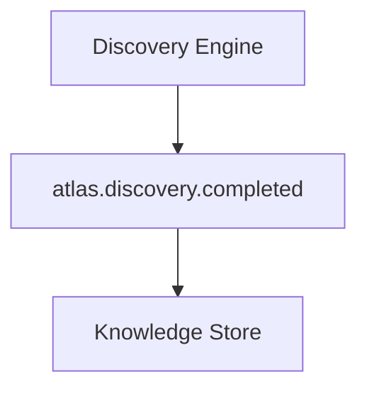
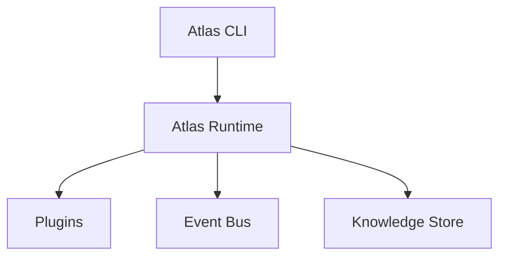
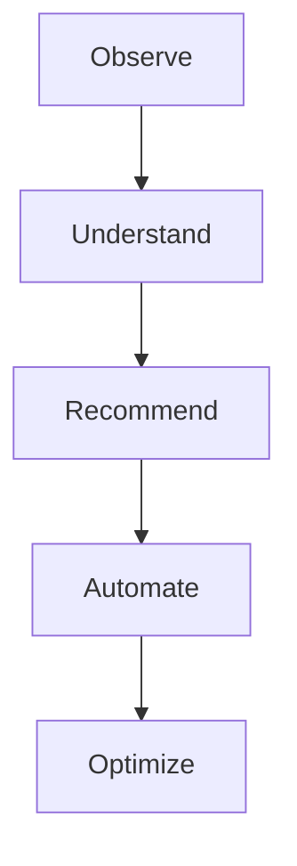

# Atlas

**AI-powered operations platform for self-hosted infrastructure.**

Atlas is an extensible infrastructure intelligence platform designed to discover, understand, and eventually automate self-hosted environments. It provides a unified operational layer for homelabs, private clouds, and self-managed infrastructure by combining:

- Infrastructure discovery
- Operational inventory
- Service awareness
- Event-driven architecture
- Persistent infrastructure knowledge
- Plugin-based extensibility
- AI-assisted operations

Atlas is currently under active development.

---

## Project Status

Atlas is progressing through its foundation and intelligence architecture phases.

### Implemented

- ✅ Python CLI application
- ✅ Configuration management
- ✅ Hardware, OS, storage, and network discovery
- ✅ Inventory generation
- ✅ Reporting engine
- ✅ Docker discovery and service detection
- ✅ Docker Compose analysis
- ✅ Proxmox integration foundation
- ✅ Plugin architecture
- ✅ Event-driven system
- ✅ Persistent operational history and knowledge storage
- ✅ AI analysis engine (pluggable Anthropic / Ollama providers)

### In Development

- 🚧 Automated operational workflows
- 🚧 Agent-based capabilities
- 🚧 Advanced monitoring integrations

---

## Quick Start

Clone the repository and set up a virtual environment:

```bash
git clone https://github.com/Cyb3rRon1n/atlas.git
cd atlas

python -m venv .venv
source .venv/bin/activate

pip install -e .
atlas version
```

Run a first discovery pass and inspect the results:

```bash
atlas discover   # inventories the host and saves it to inventory/generated/
atlas report     # generates a report from the latest inventory
atlas analyze    # sends the latest snapshot to an AI provider for a summary + recommendations
```

---

## CLI Reference

| Command | Description |
|---|---|
| `atlas version` | Display the Atlas version. |
| `atlas status` | Display current Atlas status. |
| `atlas doctor` | Run Atlas health checks. |
| `atlas config` | Display the active Atlas configuration. |
| `atlas discover` | Discover infrastructure information and generate inventory. |
| `atlas report` | Generate an infrastructure report from the latest inventory. |
| `atlas docker` | Display Docker container status. |
| `atlas services` | Detect known homelab services running in Docker. |
| `atlas compose` | Analyze a Docker Compose file. |
| `atlas proxmox scan` | Scan Proxmox infrastructure (requires `proxmox.enabled: true`). |
| `atlas plugins` | Display registered Atlas plugins. |
| `atlas discover-plugins` | Run discovery through all registered plugins. |
| `atlas history` | Display recorded operational events. |
| `atlas intelligence` | Display the latest stored environment context. |
| `atlas analyze` | Analyze the latest environment snapshot with AI and print a summary plus recommendations. |
| `atlas runtime` | Display Atlas runtime information. |

Run `atlas <command> --help` for command-specific options.

---

## Features

### Infrastructure Discovery

Atlas inspects the host system and generates a structured infrastructure inventory covering host information, OS details, CPU and memory, storage devices and filesystem usage, and network information. Discovered data is saved to `inventory/generated/system-inventory.yaml` (`atlas discover`) and feeds reporting, analysis, change detection, and future automation.

### Docker Integration

Atlas inspects Docker environments — containers, images, status, and IDs (`atlas docker`) — and can identify known homelab services running inside them (`atlas services`), for example:

```
Atlas Services

Service:  Plex
Category: Media
Container: plex
Status:   running
```

### Docker Compose Analysis

Atlas can parse a Docker Compose file (`atlas compose`) to surface its services, images, ports, and volumes.

### Proxmox Integration

Atlas includes the foundation for Proxmox infrastructure discovery (`atlas proxmox scan`): configuration support, a connection framework, and node discovery. Planned expansion includes virtual machine and container inventory, resource monitoring, and change detection.

### Plugin Architecture

Atlas uses a plugin-based design so new discovery providers, infrastructure integrations, monitoring systems, and automation capabilities can be added without rewriting the core system. The current plugin system supports registration, discovery, initialization, and plugin-level events (`atlas plugins`):

```
Atlas Plugins

Docker (0.1.0)
```

### Event System

Atlas uses an internal event bus so components can communicate without direct dependencies:



Current events include `atlas.plugin.loaded`, `atlas.discovery.completed`, and `atlas.analysis.completed`.

### Operational Memory

Atlas maintains persistent operational history — plugin events, discovery events, and infrastructure observations — as the foundation for its intelligence features (`atlas history`).

### AI Analysis Engine

Atlas can send its latest discovered environment snapshot to a configurable AI provider and get back a plain-language summary plus concrete, actionable recommendations (`atlas analyze`). The provider is pluggable:

- **Anthropic** — Claude models via the official SDK, using structured outputs so responses are always valid.
- **Ollama** — any locally-run model, for a fully self-hosted setup.

See [Configuration](#configuration) below for how to select and configure a provider. Results are persisted to Atlas's knowledge store and emit an `atlas.analysis.completed` event.

---

## Architecture

Atlas is built around a modular event-driven architecture, designed to let new capabilities be added without rewriting the core system:



---

## Configuration

Atlas uses YAML configuration, loaded from `atlas.yaml` in the working directory:

```yaml
name: sentinel

discovery:
  hardware: true
  storage: true
  network: true

inventory:
  directory: inventory/generated

intelligence:
  provider: anthropic   # or "ollama"
  model: claude-opus-5  # or an Ollama model name, e.g. llama3.1
  ollama_host: http://localhost:11434
```

The Anthropic provider reads its API key from the `ANTHROPIC_API_KEY` environment variable — it is never stored in `atlas.yaml`.

---

## Documentation

Additional documentation lives under `docs/`:

- `ATLAS_CONTEXT.md`
- `ARCHITECTURE.md`
- `HOMELAB_DESIGN.md`
- `SERVICE_CATALOG.md`
- `AI_BOOTSTRAP.md`

---

## Development

Atlas development follows incremental milestones. Current priorities, in order:

1. Core architecture
2. Discovery framework
3. Plugin ecosystem
4. Operational memory
5. Intelligence layer
6. Automation framework

---

## Contributing

Contributions, ideas, and discussions are welcome. Please read [`CONTRIBUTING.md`](CONTRIBUTING.md) before submitting changes.

## Security

Security issues should be reported according to [`SECURITY.md`](SECURITY.md).

## License

Atlas is released under the [MIT License](LICENSE).

---

## Vision

Atlas aims to become an intelligent operations platform for self-hosted infrastructure:



Atlas is being built as a foundation for infrastructure intelligence.
