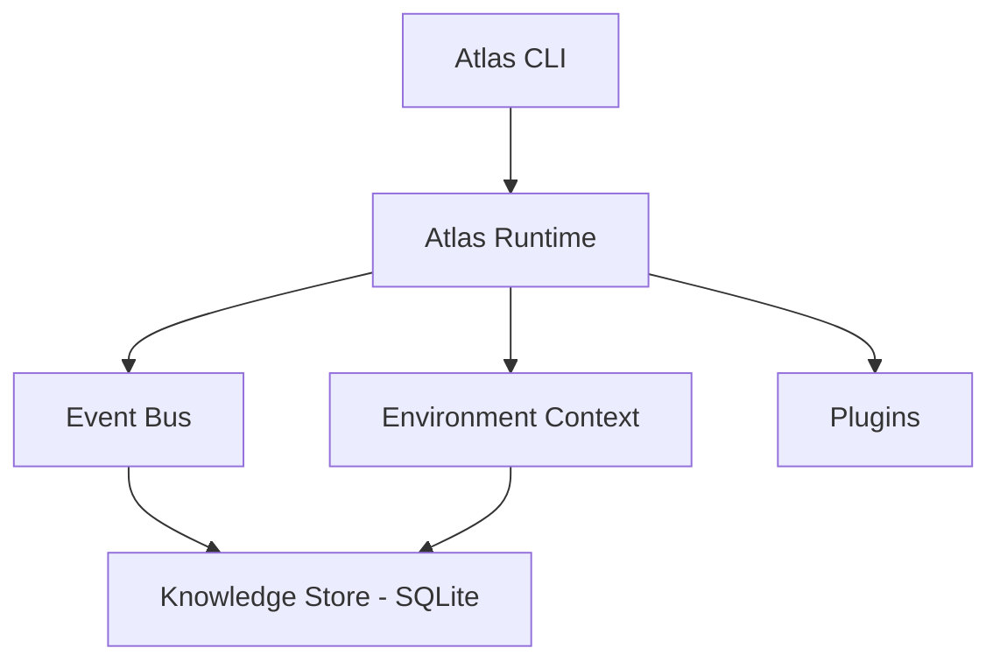

# Architecture

Atlas is built around a small runtime core, a synchronous event bus, and a local knowledge store — everything else (discovery, Docker, Compose, Proxmox, AI analysis) is a module that reads from or writes into those three things.

## Runtime

`AtlasRuntime` is constructed once, at process start, as a module-level singleton. It owns three things every subsystem shares:

- **Environment context** — the accumulated discovery snapshot (system, hardware, storage, network, services, containers, virtualization). `atlas discover` and `atlas proxmox scan` both write into it; `atlas analyze` reads from it.
- **Event bus** — a synchronous publish/subscribe bus. Discovery, plugin loading, and AI analysis all publish events (`atlas.discovery.completed`, `atlas.plugin.loaded`, `atlas.analysis.completed`, `atlas.proxmox.scan.completed`); a wildcard listener persists every event to the knowledge store automatically.
- **Config** — loaded once from `atlas.yaml` in the working directory (see [Configuration](../configuration.md)).

## Knowledge store

Atlas persists to a local SQLite database (`inventory/atlas.db`, gitignored and created automatically on first use): every event, the latest environment snapshot, and every AI analysis result. Reads and writes are split — a store component writes, a queries component reads (`latest_environment()`, `latest_analysis()`, `recent_events()`) — so the two responsibilities stay separable as more consumers show up.

`save_environment()` is insert-only — every `atlas discover` or `atlas proxmox scan` call adds a **new** row rather than overwriting the last one, so a full history of every past snapshot already exists in the database even though only `latest_environment()` is queried by most callers. Proxmox change detection (below) is the first feature to make use of that: it just has to read "latest" *before* saving the current scan, at which point "latest" is actually the previous one — no new table or query needed. The same trick is available to any future feature that wants to diff over time.

## Discovery: built-in and plugins, one command

Atlas gathers information about your environment two ways, both run by a single `atlas discover`:

- **Built-in discovery** — the synchronous path that directly collects system, hardware, storage, and network information and merges the results.
- **Plugins** — an extensible architecture (`atlas plugins` lists what's registered) where each plugin declares `initialize()` and `discover()`. Currently ships with a Docker plugin.

`atlas discover` runs both in one pass: built-in results populate `AtlasEnvironmentContext`'s system/hardware/storage/network fields, plugin results land in `AtlasEnvironmentContext.containers` (keyed by plugin name), and both are saved to the knowledge store together — so `atlas analyze` sees the complete picture from one command, the same way `atlas proxmox scan` populates its own field. Adding a new discovery source means writing an `AtlasPlugin` subclass; it's picked up automatically the next time `atlas discover` runs, no wiring changes needed.

## Proxmox change detection

`atlas proxmox scan` reads `latest_environment()` *before* saving its own results — at that moment, "latest" is whatever the previous scan (or `atlas discover`) saved, giving a free baseline to diff against with no new storage. `diff_virtualization()` (`atlas/proxmox/changes.py`) is a pure function comparing two `{"nodes": [...], "guests": [...]}` snapshots: nodes are matched by name, guests by `vmid` (Proxmox's actual stable identifier, not name — a renamed guest with the same `vmid` is correctly treated as unchanged, not as one removed and a different one added). It reports additions, removals, and status changes for both.

If there's no baseline at all (first-ever scan, or an environment that was never Proxmox-scanned before), nothing is reported — the scan output already lists every node and guest above, so treating a first sighting as a synthetic "added" change would just be noise. When there *is* a baseline, `atlas proxmox scan` prints either "No changes since last scan." or each change, and only publishes `atlas.proxmox.changes_detected` when something actually changed, keeping the event log meaningful rather than one no-op entry per scan.

## Monitoring

`atlas monitor` queries an existing Prometheus server rather than Atlas hosting its own metrics endpoint — consistent with every other integration (`atlas discover`, `atlas proxmox scan`): Atlas is always the one reaching out on command, never a long-running server itself. `atlas/monitoring/client.py`'s `query_prometheus()` hits Prometheus's stable `/api/v1/query` HTTP API for a single PromQL instant query; `collector.py`'s `collect_metrics()` runs three fixed queries against standard [`node_exporter`](https://github.com/prometheus/node_exporter) metrics — host CPU, memory, and disk usage percentage. That's a real assumption worth naming: the default queries only return data if `node_exporter` (or something exposing equivalent metric names) is actually running and scraped by your Prometheus.

The result distinguishes two kinds of "nothing here": if Prometheus itself can't be reached, `query_prometheus()` raises `PrometheusUnavailableError` and `collect_metrics()` returns `{"available": False, "metrics": {}}` — a real outage. If Prometheus is reachable but one specific query has no data (e.g. `node_exporter` isn't installed yet even though Prometheus is), that individual metric is `None` while `available` stays `True` and the other metrics still populate. Results are saved into `AtlasEnvironmentContext.monitoring` the same way Proxmox uses its own field, and `atlas.monitoring.scan.completed` publishes on every scan.

**Threshold flagging.** `collector.py`'s `evaluate_thresholds(metrics, thresholds)` is a pure function — `{metric_name: bool}` for whether each metric is at or above its configured threshold (`monitoring.cpu_threshold`/`memory_threshold`/`disk_threshold` in `atlas.yaml`, `90.0` by default each, matching the same `< 90` convention `atlas/health/checks.py` already uses for the local host's own memory/storage checks). A `None` metric (no data) or a metric with no configured threshold is left out of the result entirely rather than counted as "not exceeded" — those are different states. `atlas monitor` prints each metric with a green `✓` or yellow `!` accordingly, mirroring `atlas doctor`'s existing convention, and only publishes `atlas.monitoring.threshold_exceeded` when something actually crossed its threshold — same "don't add event-log noise for a no-op" rule Proxmox change detection follows.

**Note on verification:** now confirmed against a real Prometheus instance (Docker, `prom/prometheus` + `prom/node-exporter`) — all three default PromQL queries resolved against real metric names and returned real values, alongside the Docker and Proxmox integrations, including both the normal and threshold-exceeded paths.

**Container-level metrics (cAdvisor).** cAdvisor is treated as a second exporter scraped by the same Prometheus `atlas monitor` already queries, not a separate integration — no new config section, just two more queries. `client.py`'s `query_prometheus()` only ever returned a single scalar (`result[0]`), which doesn't fit a per-container query that returns one row per container; the shared request/parse logic was pulled into a private `_query()`, and a new `query_prometheus_vector(base_url, promql, label)` returns `{label_value: value}` for every row in the result, keyed by a caller-given Prometheus label (`"name"` for cAdvisor's container label). `collector.py`'s `collect_container_metrics()` runs two cAdvisor queries through it — CPU as percent of one core (`rate(container_cpu_usage_seconds_total[5m])*100`, the standard cAdvisor/Grafana convention) and memory as percent of host total memory (`container_memory_usage_bytes / scalar(node_memory_MemTotal_bytes) * 100`, deliberately the same unit as the host's own `memory_percent` so it can reuse `evaluate_thresholds()` and the existing `cpu_threshold`/`memory_threshold` config as-is, called once per container). A container missing from one of the two queries still appears, with `None` for that metric, same "no data yet, not an error" rule the host collector already follows. Results merge into the same `AtlasEnvironmentContext.monitoring` dict under a `containers` key — no new context field.

**Monitoring change detection.** `atlas/monitoring/changes.py`'s `diff_monitoring(previous, current, thresholds)` mirrors Proxmox's `diff_virtualization()` shape exactly (same `previous` falsy → `[]` no-baseline rule), but where Proxmox diffs raw state (node/guest status), monitoring diffs *threshold-exceeded state*: a metric — host or per-container — that moved from under-threshold to over-threshold since the last scan is a `*_metric_crossed` change; the reverse is `*_metric_recovered`. Both previous and current are evaluated against the *current* thresholds (threshold config itself isn't versioned per snapshot). `format_change()` renders each type to a display string; `atlas/cli/main.py` imports it aliased as `format_monitoring_change` since `format_change` is already bound to the Proxmox version. `atlas monitor` fetches `KnowledgeQueries().latest_environment()` up front (same placement as `atlas proxmox scan`), prints a "Changes since last scan" section, and publishes `atlas.monitoring.changes_detected` only when non-empty — a different event from `atlas.monitoring.threshold_exceeded` (which fires on "something is bad *right now*," every scan) versus this one firing on "something *changed* since last time."

**Note on verification:** confirmed against a real cAdvisor (Docker, host networking, `--privileged`) scraped by the same test Prometheus used for the earlier monitoring verification — real per-container rows returned for all three actual containers on the host, and a real threshold change between two live scans produced a genuine `container_metric_crossed` change and `atlas.monitoring.changes_detected` event.

**Container resource-allocation visibility.** `cpu_percent`/`memory_percent` answer "how busy is this host/container"; `cpu_percent_of_limit`/`memory_percent_of_limit` (two more optional keys on the same per-container dict) answer a different question — "is this container starved relative to what it was actually *allocated*." Computed entirely in PromQL against cAdvisor's own `container_spec_cpu_quota`/`container_spec_cpu_period`/`container_spec_memory_limit_bytes` metrics (the *configured* limits, not usage) — no Docker-side collection needed, since cAdvisor already exposes limits as their own metrics and this feature lives entirely inside the already-monitoring-gated `atlas monitor`. A container with no configured limit for a resource simply has `None` for that key, same "missing from the query result, not an error" rule the other container metrics already follow — most containers have no explicit limit, so this is the common case, not an edge case. Threshold-flagging reuses two new `MonitoringConfig` fields, `cpu_allocation_threshold`/`memory_allocation_threshold` (90.0 default, same convention as every other threshold), evaluated via a container-only thresholds dict rather than added to the host-level one. `diff_monitoring()`, `evaluate_thresholds()`, and `atlas.monitoring.changes_detected` needed **zero changes** — both are already generic over whatever keys a container's metrics dict contains, so an allocation-threshold crossing flows through the existing change-detection path for free. Verified against a real `--cpus=0.5 --memory=256m` test container: `cpu_percent_of_limit` tracked `cpu_percent / 0.5` exactly across live scans. One real bug surfaced doing that: the CPU query originally divided an aggregated (`sum(...) by (name)`) series against un-aggregated `container_spec_cpu_*` series, and Prometheus's default vector matching requires identical label sets — mismatched labels return no rows, not an error, so `cpu_percent_of_limit` silently came back `None` even for the container with a real limit, until an explicit `on(name)` was added to both operators.

## Resource-usage trending

`atlas trends` reads the history of environment snapshots `atlas monitor` (and `atlas discover`/`atlas proxmox scan`) have already been saving all along — `save_environment()` is insert-only, so nothing new needed collecting or storing. `KnowledgeQueries.environment_history(limit=20)` is a new method, same shape as `recent_events()`: parsed `{"created_at", "data"}` rows, most-recent-first, ordered by `created_at.desc(), id.desc()` — the `id` tiebreak matters because two real snapshots can land in the same microsecond. `atlas/monitoring/trends.py` (pure functions, same style as `atlas/monitoring/changes.py`) turns that into chronological `(timestamp, value)` points per metric: `host_metric_trend(records, metric_name)`, `container_metric_trend(records, container_name, metric_name)`, and `known_container_names(records)` to enumerate which containers appear anywhere in the window. `atlas trends` prints one summary line per metric — latest/min/max/avg over N samples — no graphs, consistent with the rest of the CLI's plain-text output.

**Every saved row only carries the categories the command that saved it actually populated**, not a complete snapshot — a real constraint, not an assumption, found by reading `atlas discover`/`atlas proxmox scan`/`atlas monitor`'s save call sites. Each is a separate CLI invocation with its own fresh in-memory environment context, so a row from `atlas monitor` has real `monitoring` data but empty `hardware`/`virtualization`, and a row from `atlas discover` is the reverse. `host_metric_trend()`/`container_metric_trend()` skip any row with no `monitoring` data at all (not just a missing individual metric) rather than assuming every row is complete. This is also why trending is scoped to host + per-container metrics only — both saved together in one `atlas monitor` row — rather than also merging in Proxmox guest CPU/memory, which is saved on a completely separate schedule by a separate command and uses a different unit (a 0–1 fraction, not a percent); that stays a deliberately separate follow-up rather than added complexity here.

Verified against real accumulated history: several real `atlas monitor` runs against the project's test Prometheus + cAdvisor setup, then `atlas trends` correctly reported genuine host CPU/memory/disk trends and per-container trends for every real container, including `cpu_percent_of_limit`/`memory_percent_of_limit` trending correctly for the one container with a real configured limit and showing nothing for the unconstrained ones.

## AI analysis

`atlas analyze` sends the latest environment snapshot to a pluggable AI provider and gets back a structured result — a summary plus a list of concrete recommendations, each with a severity. Two providers exist today:

- **Anthropic** — Claude, via the official SDK, using structured/schema-constrained output so responses are always valid (no free-text parsing).
- **Ollama** — any locally-run model, for a fully self-hosted setup consistent with Atlas's local-first philosophy.

The provider is selected in [configuration](../configuration.md#intelligence) and built through a small factory, so adding a third backend later doesn't touch the analysis logic itself.

Each recommendation can also carry a schema-validated `action` — one of `{"type": "restart_container", "target": "<container name>"}`, `{"type": "restart_guest", "target": "<vmid>"}` (a Proxmox guest, targeted by its stable `vmid`, not its name), `{"type": "stop_container", "target": "<container name>"}`, `{"type": "resize_container", "target": "<container name>", "cpus": "<new limit or null>", "memory": "<new limit or null>"}`, or `null`. `cpus`/`memory` are present (required-but-nullable) on every action type, not just `resize_container` — structured output requires every key in `required` even when the value itself is nullable, so the schema carries them everywhere and they're simply always `null` except on a resize suggestion. The `action.type` enum is generated from `atlas/actions/registry.py`'s `ACTIONS` dict rather than hand-written, so the schema can't list an action the rest of the system doesn't actually know how to handle. The AI is instructed to only populate an action when it genuinely fixes the specific problem described — `stop_container` specifically only when the *running* container itself is the problem (resource hogging, shouldn't be running), not as a way to fix a crash-looping one, which calls for `restart_container` instead; `resize_container` when a container is throttled by its own configured limit while it genuinely needs more, or over-provisioned relative to actual usage, with `cpus`/`memory` set to a new value only for the dimension actually changing. Before `atlas analyze`/`atlas chat` print anything, `AtlasAnalyzer`/`AtlasAgent` look up `ACTIONS.get(action.type)` and silently clear any action whose type isn't in the registry or whose target doesn't match `definition.known_targets(environment)`, so an AI-hallucinated container name or vmid never reaches the terminal or the knowledge store. A matching suggestion prints as a plain, copy-pasteable line via `definition.command_template(action)` (a callable now, not a format string — see [Approval-gated actions](#approval-gated-actions)); neither command ever executes it — running it is a separate, deliberate step that goes through the matching action's own independent approval gate.

## Agent-based capabilities

Both providers' `analyze()` and the new `converse()` can call a small, explicitly read-only set of tools mid-request instead of only ever seeing one fixed snapshot — `atlas/intelligence/tools.py`'s `build_tools(config)` returns `{name: ToolDefinition}` (`get_containers`, `get_services`, `get_recent_events`, `get_last_analysis`, `get_container_logs`, plus `get_proxmox_status`/`get_monitoring` when those integrations are enabled), each wrapping a function that already exists elsewhere (`collect_containers()`, `detect_services()`, `discover_nodes()`/`discover_resources()`, `collect_metrics()`/`collect_container_metrics()`) — no new data-collection code, only new AI-facing wiring. `execute_tool()` is the shared dispatcher both providers call into; an unknown tool name or a handler exception becomes `{"error": ...}` rather than raising, so a hallucinated tool call or a live query that fails (Proxmox unreachable, etc.) can't crash the session. **Deliberately no mutating tool exists here** — restart/stop/etc. stay behind their own approval-gated commands (below), never reachable from inside an analysis or chat turn.

`get_container_logs(container, tail)` is the first tool needing an argument, which surfaced a real gap: `ToolDefinition.handler` was `Callable[[], dict]` and `execute_tool(tools, name, arguments)` received real per-call arguments from both providers' tool-use loops (Anthropic's `block.input`, Ollama's `function.get("arguments")`) but never actually passed them to the handler — every prior tool got away with this by using `EMPTY_SCHEMA`. Fixed by making every handler's signature `Callable[[dict], dict]` uniformly (the zero-arg tools just ignore `arguments` now, rather than special-casing the one that needs it) and having `execute_tool()` call `definition.handler(arguments)`. The new tool itself wraps `atlas/docker/manager.py`'s `get_container_logs()` (same pure-result-dict, never-raises shape as every other manager function there), decoding `container.logs(tail=N, timestamps=False)` with `errors="replace"`. `tail` is model-controllable but capped server-side at 500 regardless of what's requested. No grounding logic needed — unlike a suggested action, a hallucinated or stale container name here just comes back as an ordinary `{"found": False, "error": "..."}` tool result via Docker's existing `NotFound` handling, not something that could reach the terminal as if it were real.

`AIProvider` gained a `tools` parameter on `analyze()` and a new `converse(messages, tools) -> ChatReply` method (`ChatReply(text, action)`, schema-constrained the same way as `AnalysisResult` via a new `CHAT_SCHEMA`/`CHAT_SYSTEM_PROMPT` pair in `base.py` — both share `ACTION_INSTRUCTIONS`, the action-grounding paragraph extracted out of the original hand-written `SYSTEM_PROMPT` so it isn't duplicated across the two prompts). `converse()` has a non-abstract default that raises `NotImplementedError` rather than being `@abstractmethod` — a provider (or test double) implementing only `analyze()` is still a valid `AIProvider`, it just can't back `atlas chat`.

Each provider runs its own manual tool-use loop (capped at a fixed iteration count so a confused model can't loop forever burning API cost), and the two loops are *not* the same shape — this was a real, verified difference between the two APIs, not a stylistic choice:

- **Anthropic** (`anthropic_provider.py`) sends `tools` and the schema-constrained `output_config.format` in the *same* request every turn — Anthropic's documented tool-use + structured-output pattern. A `tool_use` `stop_reason` means execute the tool(s) and loop with the results appended as `tool_result` blocks; anything else means parse the response as the final schema-shaped answer.
- **Ollama** (`ollama_provider.py`) *never* sends `tools` and `format` in the same request. This was empirically verified against a real local `llama3.1`: with both present, the model silently never emits `tool_calls` at all and just answers directly and ungrounded — not an error, just quietly wrong, which is worse than a normal miss because there's no signal anything went wrong. So the loop runs a tools-only phase (no `format`) until the model stops asking for tools, then makes one dedicated finalize request (`format`, no `tools`) to get the schema-shaped answer from whatever the conversation now contains. When no tools are offered at all, both providers collapse back to exactly the original single request — zero behavior change for existing `analyze()` callers that don't pass `tools`.

`atlas analyze` builds `tools` via `build_tools(settings)` and passes them by default — no config flag, since (unlike Proxmox/Prometheus) this doesn't depend on external infrastructure existing, only on data Atlas can already collect locally.

**`atlas chat`** (`atlas/cli/main.py`) is the new multi-turn command this unlocks: an interactive loop maintaining `messages` for the session's lifetime only (never persisted to the knowledge store as a new record type — no new event type, no new table). `AtlasAgent` (`atlas/intelligence/agent.py`) plays the same orchestration role for chat that `AtlasAnalyzer` plays for `atlas analyze`, applying the identical `ACTIONS.get(action.type)` + `known_targets(environment)` grounding check before ever surfacing a suggested action. The one real difference: chat has no guaranteed prior `atlas discover`, so it can't ground against a saved snapshot the way `atlas analyze` does — `AtlasAgent._live_environment()` builds a minimal grounding dict by calling live Docker/Proxmox state through the *same* tool the model itself can call (`execute_tool(self.tools, "get_proxmox_status", {})`), not a second copy of the connection logic. A suggested action prints the same `→ Suggested: atlas restart <target>` line `atlas analyze` already prints; `atlas chat` never executes it, same separation every other suggested action already keeps. Stays strictly on-demand like every other Atlas command — no daemon, no scheduled mode; typing `exit`/`quit`/Ctrl-D ends the session.

**Verified against a real local Ollama instance** (`llama3.1`): `atlas chat` correctly called `get_containers` mid-conversation and reported the real, live set of Docker containers running on the host — not a stale snapshot, not a hallucinated list. This is also what caught the tools+format bug described above; the initial combined-request implementation looked correct in isolation (it passed unit tests against a mocked client) but silently never called a tool against the real model, which only surfaced by actually running it.

`atlas chat` now also persists its transcript: `chat()` builds a second, separate `transcript` list (plain `{"role", "content"}` string pairs) alongside the `messages` list it passes to `agent.converse()`, and publishes it as one `atlas.chat.transcript_saved` event on exit — only if the session had at least one exchange. This rides the same `DatabaseListener`-on-`"*"` path every other event uses and shows up in `atlas history` for free; no new table or query method. `transcript` has to be a separate list rather than reusing `messages`: both providers mutate `messages` in place, and Anthropic's tool-use loop appends raw SDK content-block objects onto it mid-conversation, which aren't JSON-serializable — publishing `messages` directly would crash `save_event()`'s `json.dumps()` on any session where a tool got called, the common case for a command built around tool-grounded answers. Found by reading the loop, not by hitting the crash.

## Multi-step action plans

`AnalysisResult`/`ChatReply` each carry an optional `plan: SuggestedPlan | None`, alongside — not instead of — the existing single `action` field: `SuggestedPlan(summary, steps)`, where each `PlanStep(action, rationale)` uses the identical action-object shape a standalone `action` uses. This is for a genuine ordered sequence where later steps depend on earlier ones (e.g. a container needs to be stopped before restarting a different one that was failing because of it) — independent, unrelated issues should stay separate `Recommendation`s, each with its own single `action`, not be folded into a plan.

**Still suggest-only, same boundary as every action before it.** `atlas analyze`/`atlas chat` print a plan as a numbered list — each step's `definition.command_template(step.action)` plus its rationale — and nothing else; there's no `atlas plan run`, no plan persistence (`KnowledgeStore.save_analysis()` is unchanged, still only writing `summary`/`recommendations`), and no change to how any action actually executes. Each step is still run by typing the printed command yourself, one at a time, through that action's own existing approval gate.

`PLAN_SCHEMA` (`atlas/intelligence/providers/base.py`) reuses `ACTION_OBJECT_SCHEMA` — the action-object shape pulled out of `ACTION_SCHEMA` for this purpose — for each step's action, so a plan step is validated against exactly the same shape a standalone action is. Unlike the standalone `action` field, a plan step's action isn't nullable (a step without one doesn't mean anything), while the plan itself is nullable at the top level, same "required but can resolve to null" pattern `action` already uses. `PLAN_INSTRUCTIONS` (appended to both `SYSTEM_PROMPT` and `CHAT_SYSTEM_PROMPT`) tells the model a plan is for a genuine dependency chain only, and that most responses should leave `plan` null.

**Grounding treats a plan as one coherent unit.** `AtlasAnalyzer.analyze()`/`AtlasAgent.converse()` already null out any ungrounded standalone `action` via a shared `is_action_grounded()` helper (factored out of both call sites, in `atlas/actions/registry.py`, once this made it the third place doing the identical `ACTIONS.get(type)` + `known_targets(environment)` check). For a plan, the same check runs per step, but one hallucinated step target drops the **entire plan**, not just that step — a partially-runnable sequence (where you can't tell which steps are still trustworthy) is worse than either a complete plan or no plan at all.

**A real bug, found only by running a genuine dependency-chain scenario through a real local Ollama, not by any unit test:** the model filled in *both* `plan` and the standalone `action` — `action` came back as a duplicate of the plan's own first step, which would have printed a redundant "suggested action" line directly above a plan that repeats it as step 1. `PLAN_INSTRUCTIONS` now tells the model not to do this, but a prompt instruction isn't enforcement — same reasoning as target grounding — so `AtlasAgent.converse()` also nulls `reply.action` outright whenever `reply.plan` is present, after grounding. Re-verified against real Ollama afterward: a genuine 3-step scenario (stop a container, restart a second one, restart the first again) across two real Docker containers came back as a correctly ordered, correctly grounded plan with `action` now `None`; a second scenario with two independent, unrelated container issues correctly produced two separate recommendations and left `plan` `None` — confirming the model isn't defaulting to a plan when the situation doesn't call for one.

## Approval-gated actions

Every command up through `atlas discover`/`atlas proxmox scan`/`atlas monitor` is read-only. `atlas restart <name>` (Docker) was the first exception — the first thing Atlas could *do* to your infrastructure rather than just report on it. `atlas proxmox restart <vmid>` (a Proxmox VM/LXC guest) was the second. `atlas stop <name>` (Docker, without removing the container) was the third — a different verb, not just another restart on a different resource, which is what actually forced the registry below into existence rather than staying two dicts. `atlas resize <name>` (Docker, `--cpus`/`--memory`) is the fourth — the first one that isn't a single fixed operation. All four share the same deliberately narrow, safety-first shape:

- **Pure result-dict functions** — `get_container_info()`/`restart_container()`/`stop_container()`/`resize_container()` (`atlas/docker/manager.py`) and `get_guest_info()`/`restart_guest()` (`atlas/proxmox/manager.py`) never raise the underlying library's exceptions to the caller; they return `{"found"/"success": bool, ...}`, the same style `collect_containers()` already used. The CLI layer only interprets plain dicts.
- **Unconditional confirmation** — each CLI command shows what will happen (current state, what the action means, what's preserved) and gates on `typer.confirm()`, which defaults to *no*. There's no `--yes` bypass; convenience loses to safety until there's a real reason to add one.
- **Logged like everything else** — each action publishes its own event (`atlas.action.container_restarted`, `atlas.action.guest_restarted`, `atlas.action.container_stopped`, `atlas.action.container_resized`) on the same event bus discovery uses, so it's persisted to the knowledge store the same way, visible via `atlas history`, with no special-cased storage code.

`atlas resize` doesn't use docker-py's `container.update()` — a real, verified-against-a-live-container finding, not an assumption. `docker run --cpus=0.5` (the standard path) sets `HostConfig.NanoCpus`, not `CpuPeriod`/`CpuQuota`; a `container.update(cpu_period=..., cpu_quota=...)` call against that same container fails with a real `409 Conflict` (Docker refuses to mix the two CPU-limiting mechanisms on one container), and docker-py's `update_container()` has no `NanoCPUs` parameter at all, even though the raw Docker Engine API accepts one (confirmed: the real `docker update --cpus` CLI does set it). `resize_container()` posts that raw API request directly instead — reusing docker-py's own `client.api` (a `requests.Session` subclass with the Docker-socket transport adapter already registered), not a new HTTP dependency or a shell-out to the `docker` CLI. Verified end to end: current-state display, a combined CPU+memory resize actually taking effect live (confirmed via `docker inspect` before/after, no restart), and an intentionally-too-low memory value failing cleanly with a caught `400 Bad Request`.

`atlas analyze`/`atlas chat`'s suggested actions (above) deliberately stop at *suggesting* — recommend and act stay separate commands, each with their own approval boundary, rather than one command that both diagnoses and executes. **`atlas/actions/`** is the real action registry the roadmap called for — `atlas/actions/registry.py`'s `ActionDefinition` (`type`, `command_template`, `known_targets`) and the `ACTIONS` dict populated with all four entries, `atlas/actions/targets.py`'s `known_container_names()`/`known_guest_ids()` behind them (`resize_container` reuses `known_container_names` unchanged — same target kind as `restart_container`/`stop_container`). Still deliberately just a dataclass + dict, not a class hierarchy or plugin system. `command_template` is a small callable (`Callable[[SuggestedAction], str]`) rather than a plain format string — forced by `resize_container` needing more than one substitution; the three older entries are one-line lambdas, and `resize_container`'s conditionally includes `--cpus`/`--memory` only for whichever dimension was actually proposed, so a partial resize stays expressible. Both `atlas analyze` and `atlas chat`'s print logic call `definition.command_template(action)` directly now — no per-action-type branching added to the CLI. This is now the one place both `AtlasAnalyzer`/`AtlasAgent` and the CLI's print logic read from, instead of separately-maintained dicts plus a hand-written schema enum. Adding a fifth action means one `ACTIONS` entry, one manager function, one CLI command, and one `ACTION_INSTRUCTIONS` sentence.
