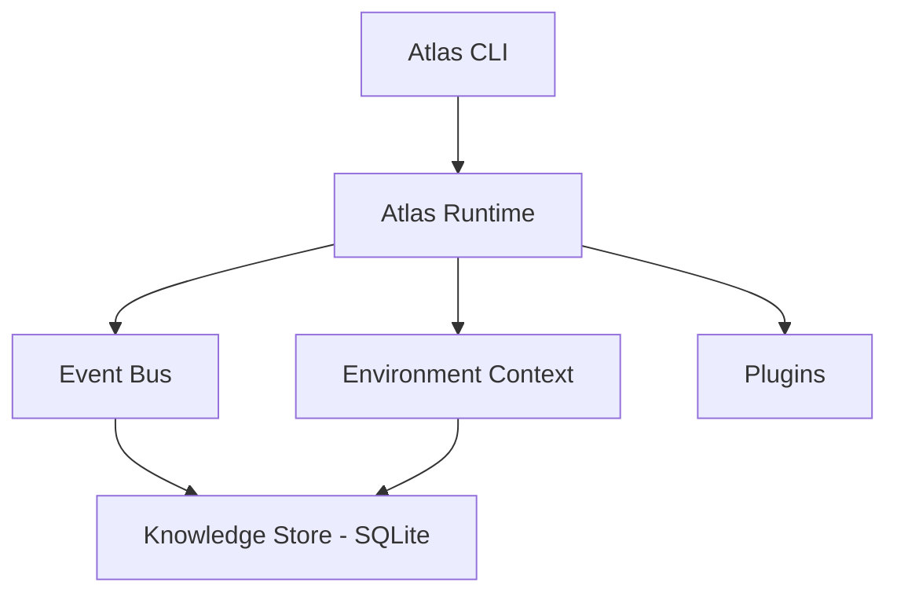

# Architecture

Atlas is built around a small runtime core, a synchronous event bus, and a local knowledge store — everything else (discovery, Docker, Compose, Proxmox, AI analysis) is a module that reads from or writes into those three things.

## Runtime

`AtlasRuntime` is constructed once, at process start, as a module-level singleton. It owns three things every subsystem shares:

- **Environment context** — the accumulated discovery snapshot (system, hardware, storage, network, services, containers, virtualization). `atlas discover` and `atlas proxmox scan` both write into it; `atlas analyze` reads from it.
- **Event bus** — a synchronous publish/subscribe bus. Discovery, plugin loading, and AI analysis all publish events (`atlas.discovery.completed`, `atlas.plugin.loaded`, `atlas.analysis.completed`, `atlas.proxmox.scan.completed`); a wildcard listener persists every event to the knowledge store automatically.
- **Config** — loaded once from `atlas.yaml` in the working directory (see [Configuration](../configuration.md)).

## Knowledge store

Atlas persists to a local SQLite database (`inventory/atlas.db`): every event, the latest environment snapshot, and every AI analysis result. Reads and writes are split — a store component writes, a queries component reads (`latest_environment()`, `latest_analysis()`, `recent_events()`) — so the two responsibilities stay separable as more consumers show up.

`save_environment()` is insert-only — every `atlas discover` or `atlas proxmox scan` call adds a **new** row rather than overwriting the last one, so a full history of every past snapshot already exists in the database even though only `latest_environment()` is queried by most callers. Proxmox change detection (below) is the first feature to make use of that: it just has to read "latest" *before* saving the current scan, at which point "latest" is actually the previous one — no new table or query needed. The same trick is available to any future feature that wants to diff over time.

## Discovery: built-in and plugins, one command

Atlas gathers information about your environment two ways, both run by a single `atlas discover`:

- **Built-in discovery** — the synchronous path that directly collects system, hardware, storage, and network information and merges the results.
- **Plugins** — an extensible architecture (`atlas plugins` lists what's registered) where each plugin declares `initialize()` and `discover()`. Currently ships with a Docker plugin.

`atlas discover` runs both in one pass: built-in results populate `AtlasEnvironmentContext`'s system/hardware/storage/network fields, plugin results land in `AtlasEnvironmentContext.containers` (keyed by plugin name), and both are saved to the knowledge store together — so `atlas analyze` sees the complete picture from one command, the same way `atlas proxmox scan` populates its own field. Adding a new discovery source means writing an `AtlasPlugin` subclass; it's picked up automatically the next time `atlas discover` runs, no wiring changes needed.

## Proxmox change detection

`atlas proxmox scan` reads `latest_environment()` *before* saving its own results — at that moment, "latest" is whatever the previous scan (or `atlas discover`) saved, giving a free baseline to diff against with no new storage. `diff_virtualization()` (`atlas/proxmox/changes.py`) is a pure function comparing two `{"nodes": [...], "guests": [...]}` snapshots: nodes are matched by name, guests by `vmid` (Proxmox's actual stable identifier, not name — a renamed guest with the same `vmid` is correctly treated as unchanged, not as one removed and a different one added). It reports additions, removals, and status changes for both.

If there's no baseline at all (first-ever scan, or an environment that was never Proxmox-scanned before), nothing is reported — the scan output already lists every node and guest above, so treating a first sighting as a synthetic "added" change would just be noise. When there *is* a baseline, `atlas proxmox scan` prints either "No changes since last scan." or each change, and only publishes `atlas.proxmox.changes_detected` when something actually changed, keeping the event log meaningful rather than one no-op entry per scan.

## Monitoring

`atlas monitor` queries an existing Prometheus server rather than Atlas hosting its own metrics endpoint — consistent with every other integration (`atlas discover`, `atlas proxmox scan`): Atlas is always the one reaching out on command, never a long-running server itself. `atlas/monitoring/client.py`'s `query_prometheus()` hits Prometheus's stable `/api/v1/query` HTTP API for a single PromQL instant query; `collector.py`'s `collect_metrics()` runs three fixed queries against standard [`node_exporter`](https://github.com/prometheus/node_exporter) metrics — host CPU, memory, and disk usage percentage. That's a real assumption worth naming: the default queries only return data if `node_exporter` (or something exposing equivalent metric names) is actually running and scraped by your Prometheus.

The result distinguishes two kinds of "nothing here": if Prometheus itself can't be reached, `query_prometheus()` raises `PrometheusUnavailableError` and `collect_metrics()` returns `{"available": False, "metrics": {}}` — a real outage. If Prometheus is reachable but one specific query has no data (e.g. `node_exporter` isn't installed yet even though Prometheus is), that individual metric is `None` while `available` stays `True` and the other metrics still populate. Results are saved into `AtlasEnvironmentContext.monitoring` the same way Proxmox uses its own field, and `atlas.monitoring.scan.completed` publishes on every scan.

**Note on verification:** unlike the Docker and Proxmox integrations, this was built and tested against mocked HTTP responses matching Prometheus's documented API shape, not against a live Prometheus instance — none exists in this environment yet. The request/response handling is solid; the specific PromQL queries haven't been confirmed against a real `node_exporter`.

## AI analysis

`atlas analyze` sends the latest environment snapshot to a pluggable AI provider and gets back a structured result — a summary plus a list of concrete recommendations, each with a severity. Two providers exist today:

- **Anthropic** — Claude, via the official SDK, using structured/schema-constrained output so responses are always valid (no free-text parsing).
- **Ollama** — any locally-run model, for a fully self-hosted setup consistent with Atlas's local-first philosophy.

The provider is selected in [configuration](../configuration.md#intelligence) and built through a small factory, so adding a third backend later doesn't touch the analysis logic itself.

Each recommendation can also carry a schema-validated `action` — today, only `{"type": "restart_container", "target": "<container name>"}` or `null`. The AI is schema-locked to that one action type (a length-1 enum, extended when a second action ships) and instructed to only populate it when a restart genuinely fixes the specific problem described. Before `atlas analyze` prints anything, `AtlasAnalyzer` cross-checks every non-null `action.target` against the container names actually present in the environment snapshot (`known_container_names()` in `atlas/intelligence/analyzer.py`) and silently clears any action that doesn't match something Atlas actually observed — an AI-hallucinated container name never reaches the terminal or the knowledge store. A matching suggestion prints as a plain, copy-pasteable line (`→ Suggested: atlas restart plex`); `atlas analyze` never executes it or prompts to — running it is a separate, deliberate step that goes through `atlas restart`'s own independent approval gate. See [Approval-gated actions](#approval-gated-actions) below for why that separation is deliberate.

## Approval-gated actions

Every command so far has been read-only. `atlas restart <name>` is the first exception — the first thing Atlas can *do* to your infrastructure rather than just report on it — and it's built to a deliberately narrow, safety-first shape rather than a general "action framework," since there's only one action to generalize from so far:

- **Pure result-dict functions** — `get_container_info()` / `restart_container()` (`atlas/docker/manager.py`) never raise Docker exceptions up to the caller; they return `{"found"/"success": bool, ...}`, the same style `collect_containers()` already used. The CLI layer only interprets plain dicts.
- **Unconditional confirmation** — the CLI command shows what will happen (current container state, what restart means, that in-container state is lost but volumes aren't) and gates on `typer.confirm()`, which defaults to *no*. There's no `--yes` bypass in this first pass; convenience loses to safety until there's a real reason to add one.
- **Logged like everything else** — the action publishes an event (`atlas.action.container_restarted`) on the same event bus discovery uses, so it's persisted to the knowledge store the same way, visible via `atlas history`, with no special-cased storage code.

`atlas analyze`'s suggested actions (above) deliberately stop at *suggesting* — recommend and act stay two separate commands, each with their own approval boundary, rather than one command that both diagnoses and executes. Any future action (Proxmox VM control, container removal, etc.) should follow this same shape. A generic action registry is intentionally not built yet — see the [Roadmap](../roadmap.md).
