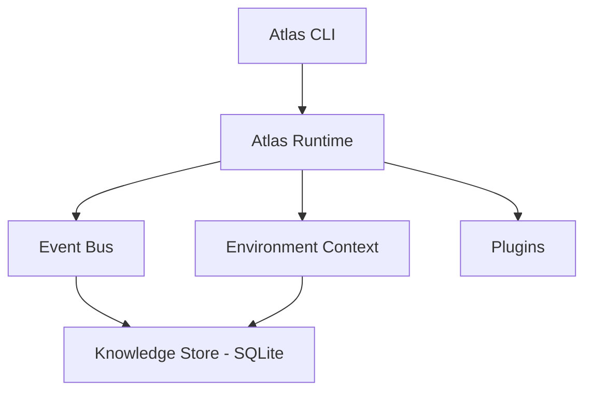

# Architecture

Atlas is built around a small runtime core, a synchronous event bus, and a local knowledge store — everything else (discovery, Docker, Compose, Proxmox, AI analysis) is a module that reads from or writes into those three things.

## Runtime

`AtlasRuntime` is constructed once, at process start, as a module-level singleton. It owns three things every subsystem shares:

- **Environment context** — the accumulated discovery snapshot (system, hardware, storage, network, services, containers, virtualization). `atlas discover` and `atlas proxmox scan` both write into it; `atlas analyze` reads from it.
- **Event bus** — a synchronous publish/subscribe bus. Discovery, plugin loading, and AI analysis all publish events (`atlas.discovery.completed`, `atlas.plugin.loaded`, `atlas.analysis.completed`, `atlas.proxmox.scan.completed`); a wildcard listener persists every event to the knowledge store automatically.
- **Config** — loaded once from `atlas.yaml` in the working directory (see [Configuration](../configuration.md)).

## Knowledge store

Atlas persists to a local SQLite database (`inventory/atlas.db`): every event, the latest environment snapshot, and every AI analysis result. Reads and writes are split — a store component writes, a queries component reads (`latest_environment()`, `latest_analysis()`, `recent_events()`) — so the two responsibilities stay separable as more consumers show up.

## Discovery: built-in and plugins, one command

Atlas gathers information about your environment two ways, both run by a single `atlas discover`:

- **Built-in discovery** — the synchronous path that directly collects system, hardware, storage, and network information and merges the results.
- **Plugins** — an extensible architecture (`atlas plugins` lists what's registered) where each plugin declares `initialize()` and `discover()`. Currently ships with a Docker plugin.

`atlas discover` runs both in one pass: built-in results populate `AtlasEnvironmentContext`'s system/hardware/storage/network fields, plugin results land in `AtlasEnvironmentContext.containers` (keyed by plugin name), and both are saved to the knowledge store together — so `atlas analyze` sees the complete picture from one command, the same way `atlas proxmox scan` populates its own field. Adding a new discovery source means writing an `AtlasPlugin` subclass; it's picked up automatically the next time `atlas discover` runs, no wiring changes needed.

## AI analysis

`atlas analyze` sends the latest environment snapshot to a pluggable AI provider and gets back a structured result — a summary plus a list of concrete recommendations, each with a severity. Two providers exist today:

- **Anthropic** — Claude, via the official SDK, using structured/schema-constrained output so responses are always valid (no free-text parsing).
- **Ollama** — any locally-run model, for a fully self-hosted setup consistent with Atlas's local-first philosophy.

The provider is selected in [configuration](../configuration.md#intelligence) and built through a small factory, so adding a third backend later doesn't touch the analysis logic itself.
