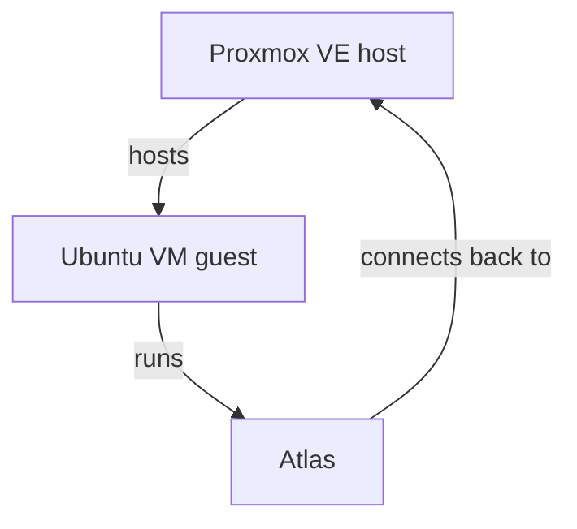

# Deployment

## The intended model

Atlas is designed to run **as a guest on the Proxmox host it's helping you manage**, not as an external tool polling your infrastructure from somewhere else:

The typical setup:

1. Install Proxmox VE on your hardware.
2. Create an Ubuntu VM inside that Proxmox host.
3. Clone Atlas into that VM and run it there.

Because Atlas runs on the same cluster it inspects, connecting back to the Proxmox API is a same-network call rather than something exposed externally.

## Authentication: use a scoped API token, not the root password

Atlas's [`proxmox` configuration](../configuration.md#proxmox) accepts either a password or an API token. **Prefer the token.** Generate one in the Proxmox UI under **Datacenter → Permissions → API Tokens**, and grant it a role scoped to only what Atlas actually needs — read access is sufficient for `atlas proxmox scan`'s current inventory capabilities.

This isn't just caution for its own sake — it's the project's own stated principle. From `CONTRIBUTING.md`:

!!! note "Safety"
    Changes affecting infrastructure should be observable, logged, reversible whenever possible, and configurable through user approval.

Atlas's role is to assist — observe, understand, recommend — not to require unrestricted access to operate. A least-privilege token that can be widened later is a better default than broad access you have to walk back.

## What this means for the rest of Atlas

Every discovery path (`atlas discover`, `atlas proxmox scan`) feeds into the same local knowledge store and environment context, which `atlas analyze` reads from. Nothing about the deployment model changes the trust boundary of the intelligence layer: recommendations come from Anthropic or a local Ollama model reasoning over what Atlas observed, not from Atlas taking action on its own.
