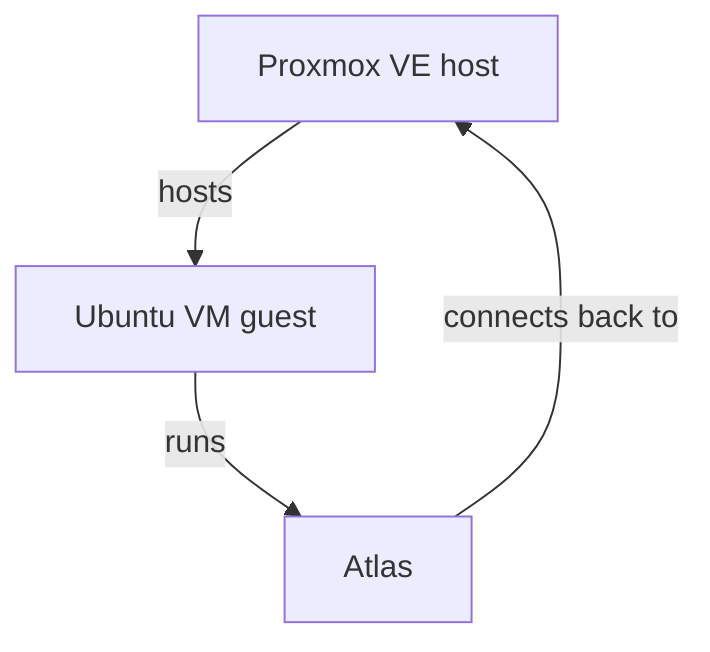

# Deployment

## The intended model

Atlas is designed to run **as a guest on the Proxmox host it's helping you manage**, not as an external tool polling your infrastructure from somewhere else:

The typical setup:

1. Install Proxmox VE on your hardware, on a static (or DHCP-reserved) IP — Atlas's config keys off a fixed host address, and Proxmox itself expects a stable management IP regardless.
2. Create an Ubuntu VM inside that Proxmox host.
3. Clone Atlas into that VM, install it (`pip install -e .`), and run `atlas init` there to generate `atlas.yaml` — see [Getting Started](../getting-started/index.md).

Because Atlas runs on the same cluster it inspects, connecting back to the Proxmox API is a same-network call rather than something exposed externally.

## Authentication: use a scoped API token, not the root password

Atlas's [`proxmox` configuration](../configuration.md#proxmox) accepts either a password or an API token. **Prefer the token.** Generate one in the Proxmox UI under **Datacenter → Permissions → API Tokens** (create a dedicated user first, e.g. `atlas@pve` under the *Proxmox VE authentication server* realm, rather than tokenizing `root@pam`), and grant it a role scoped to only what Atlas actually needs — the built-in `PVEAuditor` role is read-only and sufficient for `atlas proxmox scan`. `atlas proxmox restart` needs additional power-management permission on top of that — confirmed against a real Proxmox instance, granting the built-in `PVEVMUser` role (which includes `VM.PowerMgmt`) at path `/` is enough. `atlas init` prompts for the token directly and writes it into `atlas.yaml` for you; it does not create the token in Proxmox itself, so generate it in the UI first.

**Privilege Separation gotcha, confirmed against a real Proxmox instance**: when creating the API token, Proxmox defaults **Privilege Separation** to on, meaning the *token* (`atlas@pve!atlas-token`) has its own permission set, separate from the *user* (`atlas@pve`). Permissions granted only to the user — e.g. adding `PVEVMUser` to `atlas@pve` — do **not** apply to the token while separation is on, even though it looks like it should; `atlas proxmox restart` will 403 with `Permission check failed (.../VM.PowerMgmt)` despite the role being correctly assigned. Either grant permissions to the token identity specifically (it's selectable in the same "User" field in **Datacenter → Permissions → Add**, listed as `atlas@pve!atlas-token`), or — simpler, and no real security loss since this is already a single-purpose account — uncheck **Privilege Separation** on the token itself (**Datacenter → Permissions → API Tokens** → edit the token) so it just inherits whatever the user has.

This isn't just caution for its own sake — it's the project's own stated principle. From `CONTRIBUTING.md`:

!!! note "Safety"
    Changes affecting infrastructure should be observable, logged, reversible whenever possible, and configurable through user approval.

Atlas's role is to assist — observe, understand, recommend — not to require unrestricted access to operate. A least-privilege token that can be widened later is a better default than broad access you have to walk back.

## What this means for the rest of Atlas

Every discovery path (`atlas discover`, `atlas proxmox scan`) feeds into the same local knowledge store and environment context, which `atlas analyze` reads from. Nothing about the deployment model changes the trust boundary of the intelligence layer: recommendations come from Anthropic or a local Ollama model reasoning over what Atlas observed, not from Atlas taking action on its own.
