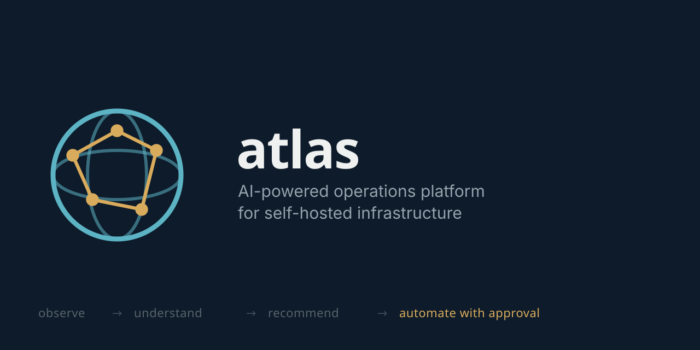
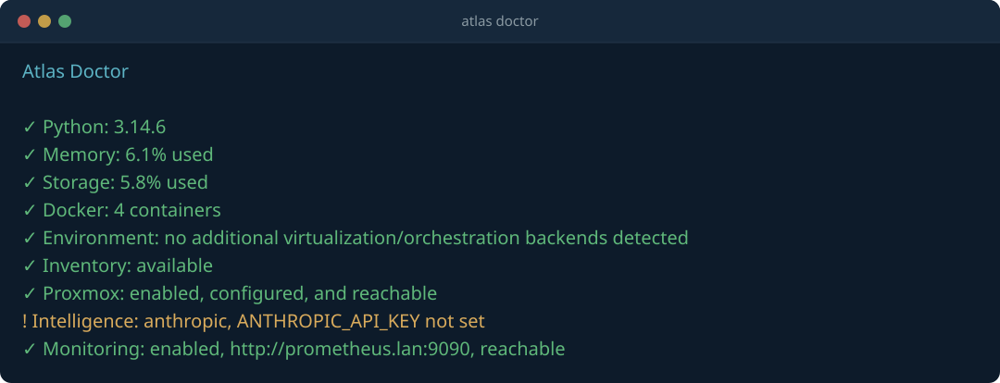
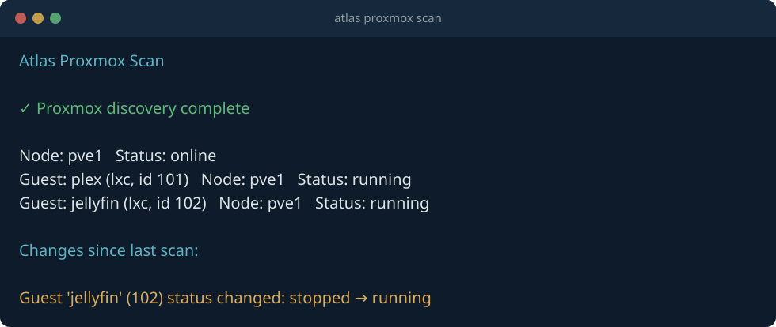
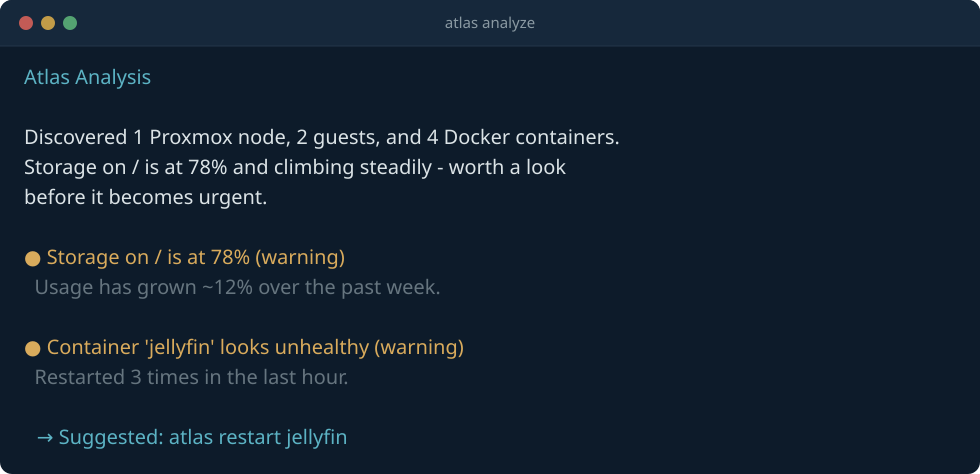

  

# Atlas

**AI-powered operations platform for self-hosted infrastructure.**

Atlas is an extensible infrastructure intelligence platform designed to discover, understand, and eventually automate self-hosted environments — homelabs, private clouds, and self-managed infrastructure.

Atlas is guided by one principle:

!!! quote "Observe first. Understand second. Recommend third. Automate with approval."
    Atlas should never blindly modify infrastructure. It gathers information, builds context, explains its findings, and requires approval before anything destructive.

## What Atlas does today

- **Discovers** your hardware, OS, storage, network, Docker containers, Compose stacks, and Proxmox cluster (nodes, VMs, and containers)
- **Remembers** what it finds — every discovery run and event is persisted to a local knowledge store
- **Analyzes** that knowledge with an AI provider (Anthropic Claude or a self-hosted Ollama model) and returns a plain-language summary plus concrete recommendations
- **Extends** via a plugin architecture and an internal event bus, so new capabilities don't require rewriting the core

See [Architecture](architecture/index.md) for how these pieces fit together, or jump straight to [Getting Started](getting-started/index.md).

## See it in action

Representative output, not a literal capture — field names and formatting match real commands; hostnames, containers, and figures are illustrative.

   
  <code>atlas doctor</code> — environment health plus integration readiness

   
  <code>atlas proxmox scan</code> — cluster inventory and change detection since the last scan

   
  <code>atlas analyze</code> — AI summary with a grounded, approval-gated action suggestion

## Where this is headed

Atlas isn't meant to run on your laptop and poke at infrastructure from the outside — see [Deployment](deployment/index.md) for the intended model of Atlas running as a guest on the Proxmox host it's helping you manage. The [Roadmap](roadmap.md) covers what's shipped and what's next.
