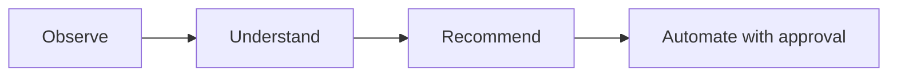

# Roadmap

## Shipped

- [x] Python CLI application, configuration management
- [x] Hardware, OS, storage, and network discovery
- [x] Inventory generation and reporting
- [x] Docker discovery and known-service detection ([Service Catalog](service-catalog.md))
- [x] Docker Compose analysis
- [x] Event-driven system with persistent operational history
- [x] Plugin architecture (currently: a Docker plugin)
- [x] **Proxmox integration** — node discovery, cluster-wide VM/container inventory, API token authentication
- [x] **AI analysis engine** — `atlas analyze`, pluggable Anthropic/Ollama providers, structured recommendations
- [x] Test suite (156 tests) and CI (GitHub Actions, Python 3.11/3.12)
- [x] **Unified discovery** — `atlas discover` now runs built-in discovery and every registered plugin in one pass, saving one complete environment snapshot; the separate `atlas discover-plugins` command was removed once its job was folded in
- [x] **First automation action** — `atlas restart <name>` restarts a Docker container after showing its state and requiring confirmation, logged via the event bus. The first Atlas command that acts rather than observes — see [Architecture](architecture/index.md#approval-gated-actions). Along the way, found and fixed a real bug: the event bus's knowledge-store listener was defined but never actually registered, so no published event had ever been persisted (`atlas history` was effectively non-functional before this).
- [x] **`atlas analyze` suggests actions** — recommendations carry a schema-validated, optional `action` field (currently just `restart_container`); `AtlasAnalyzer` cross-checks the suggested target against containers Atlas actually observed and drops anything ungrounded before it's shown. `atlas analyze` only prints the suggestion (`→ Suggested: atlas restart plex`) — running it is a separate step through `atlas restart`'s own approval gate, not something `analyze` executes itself.
- [x] **Proxmox change detection** — `atlas proxmox scan` now reports what changed since the last scan (nodes/guests added, removed, or status-changed) and logs it via `atlas.proxmox.changes_detected`. This turned out not to need new storage: `save_environment()` was already insert-only, so a full history of past snapshots already existed in the database — this item was mis-scoped before it was actually looked into, the same way the event-listener registration gap was.
- [x] **Monitoring integration** — `atlas monitor` queries an existing Prometheus server for host CPU/memory/disk usage via standard `node_exporter` metrics, following the same "Atlas reaches out on command" shape as every other integration rather than exposing a `/metrics` endpoint. Disabled by default; verified against a real Prometheus + `node_exporter` — see [Architecture](architecture/index.md#monitoring) and "Verification against real infrastructure" below.
- [x] **Fixed: database tables were never created automatically.** `atlas.database.initialize_database()` existed but nothing called it, and the (then still committed) `inventory/atlas.db` predated the `AnalysisRecord` model — so `atlas analyze` would crash on its very first real use (`no such table: analysis`), and a genuinely fresh install with no pre-existing db would crash on *any* command that touches the database. Fixed by calling `initialize_database()` lazily at the top of every `KnowledgeStore`/`KnowledgeQueries` method rather than at construction time — construction happens as part of the `AtlasRuntime` singleton built at module import, so doing it there would create/mutate the database using whatever the process's cwd happens to be at first import (e.g. the real repo root during a `pytest` run), not the user's actual working directory. Verified against a copy of the (then still committed) db (existing rows untouched, missing table added) and against a fresh directory with no `inventory/` at all.
- [x] **`inventory/atlas.db` un-tracked from git.** It grows a new row on every command run and now self-heals its own schema (above), so there was nothing left it needed to seed — keeping it committed just meant every real usage session against real hardware would show up as a binary diff to commit. It's gitignored now; the file still exists locally and nothing about its behavior changed.
- [x] **`atlas doctor` readiness checks** — now also checks the three integrations that were previously invisible to it: Proxmox (enabled + host + credentials present), the AI provider (`ANTHROPIC_API_KEY` set for Anthropic; no key needed for Ollama), and Prometheus (enabled + URL present). These were config/presence checks only, not live connection attempts — `doctor` stayed fast and could never hang waiting on a network call. Superseded below: these became real, timeout-bounded reachability checks once that trade-off was revisited. A disabled integration reports healthy (`✓ Proxmox: disabled`) since that's a valid, intentional state, not a problem; only "enabled but misconfigured" reports unhealthy. This is what actually answers "is this ready for my real setup" from the command line instead of by hand.
- [x] **Second automation action: `atlas proxmox restart <vmid>`** — restarts a Proxmox VM or LXC guest, the same approval-gated shape as `atlas restart` for Docker (pure result-dict manager function, unconditional `typer.confirm()`, logged via the event bus). This forced the action framework's first real generalization, previously only ever exercised with one action type: `ANALYSIS_SCHEMA`'s `action.type` enum, `AtlasAnalyzer`'s target-grounding check, and `analyze()`'s suggested-command print all moved from a single hardcoded case to small lookup dicts (`TARGET_VALIDATORS`, `action_commands`) keyed by action type — see [Architecture](architecture/index.md#approval-gated-actions). Needs write/power-management permission on the Proxmox token beyond the read-only scope `scan` uses. Along the way, found and fixed two more real bugs in the database-initialization fix from the previous entry (see git history / CLAUDE.md for the full detail).
- [x] **`atlas init`** — interactively generates `atlas.yaml`, prompting only for what actually varies per deployment (instance name, Proxmox, AI provider, Prometheus) and leaving `discovery`/`inventory` at their defaults. `ANTHROPIC_API_KEY` is never prompted for or written. Every run is logged to `logs/atlas-init-<timestamp>.log`, with secret values deliberately excluded from the log even though they're written to `atlas.yaml` itself. Existing `atlas.yaml` is protected behind the same `typer.confirm()` overwrite gate every other mutating command uses.
- [x] **Verification against real infrastructure** — Proxmox, both AI providers (Anthropic/Ollama), and Prometheus checked off integration-by-integration against real live systems, distinct from "built and unit-tested":
  - [x] Proxmox discovery and restart — real Proxmox VE host, real LXC guest
  - [x] Ollama — real local instance, full end-to-end `atlas analyze` run
  - [x] Prometheus — real Prometheus + `node_exporter`
  - [ ] Anthropic — auth + error-handling path confirmed against a real key; a fully successful (non-error) response is still blocked on adding billing credits, a deliberate deferral rather than a technical gap
- [x] **Broader automation framework: `atlas stop <name>` and a real `atlas/actions/` registry** — a third action type (Docker container stop), the one that actually forced `ActionDefinition`/`ACTIONS` to generalize into a real registry instead of three separately-maintained lookup structures.
- [x] **Monitoring threshold/alerting** — configurable per-metric thresholds (`90.0` default), yellow `!` flagging, `atlas.monitoring.threshold_exceeded` published only when something actually crossed. No push notifications (email/Slack/etc.) by design — see "Deliberately out of scope" below.
- [x] **Deeper monitoring: cAdvisor container metrics and Proxmox-style change detection** — per-container CPU/memory via cAdvisor as a second Prometheus exporter, plus `diff_monitoring()` change detection mirroring the Proxmox pattern. Verified against a real cAdvisor instance.
- [x] **Agent-based capabilities: tool-use + `atlas chat`** — both AI providers can call a small, deliberately read-only set of tools mid-request; no mutating tool exists here by design — see "Deliberately out of scope" below. Unlocks `atlas chat`, a multi-turn command that grounds against live state instead of a saved snapshot. Verified against a real local Ollama, including a real bug found only by running against a live model (Ollama silently never called a tool when `tools` and `format` were sent together — fixed by splitting into a tools-only gathering phase then a separate finalize request).
- [x] **Container resource-allocation visibility** — `cpu_percent_of_limit`/`memory_percent_of_limit` via two more cAdvisor PromQL queries, no new Docker-side collection needed. Verified against a real resource-constrained test container.
- [x] **The `resize_container` action** — a fourth action type, the first needing more than a flat `{target}` substitution (`command_template` became a small callable). Found a real, significant course-correction only by resizing an actual live container: `docker run --cpus` sets `NanoCpus`, which docker-py's `update_container()` doesn't expose at all — fixed by posting the raw Engine API request directly through docker-py's own transport.
- [x] **Multi-step action plans** — `AnalysisResult`/`ChatReply` can carry an ordered `plan` of dependent steps, still suggest-only at this point. Grounding treats a plan as one unit — one hallucinated step target drops the whole plan.
- [x] **Persist `atlas chat` transcripts** — one `atlas.chat.transcript_saved` event per session, riding the existing event-log path, no new table.
- [x] **`get_container_logs` tool** — read-only, server-side capped at 500 lines. Found and fixed a real gap along the way: tool handlers never actually received call arguments until this forced the fix (every prior tool got away with it by using an empty schema).
- [x] **Resource-usage trending (`atlas trends`)** — new query/reporting code over data that was already being saved (`save_environment()` is insert-only), not new storage. Explicitly skips rows missing the field being trended, since each command only ever populates the categories it collects.
- [x] **Proxmox stop/resize parity** — `atlas proxmox stop`/`resize` close the gap between Docker's three actions and Proxmox's one, through the same registry pattern. QEMU's hotplug-for-live-memory-resize caveat has since been independently verified against a real QEMU VM (see below).
- [x] **Plan execution** — `atlas analyze`/`atlas chat` can now run a printed plan step-by-step, each with its own confirmation, via a generic `execute_action()` dispatcher. Narrower than originally scoped: no plan persistence, no `atlas plan run` command — the plan already exists in memory the moment it's printed.
- [x] **`--json` output + cron-friendly exit codes** — `atlas doctor`/`atlas monitor`/`atlas trends` gained `--json`; exit codes are meaningful all the time, not just in JSON mode, so a plain cron job can check `$?` with no parsing at all.
- [x] **QEMU VM resize/hotplug caveat, verified** — confirmed against a real QEMU VM via Proxmox's own `pending` API, including a real gotcha the original caveat didn't anticipate (enabling `hotplug: memory` on an already-running VM doesn't retroactively grant live-resize capability).
- [x] **Second-distro verification** — found the project's real day-to-day dev/test platform was Fedora all along, not Ubuntu as previously (incorrectly) documented; corrected. Ubuntu is verified via CI, Fedora via every piece of real-infrastructure testing in this project's history.
- [x] **Proxmox guest usage in `atlas trends`** — the last item deferred when trending shipped. Reused the exact same "skip rows lacking the field" pattern already built for the monitor-vs-discover split; needed zero new machinery.
- [x] **A lightweight read-only web view (`atlas web`)** — a local overview/history/trends dashboard, `http.server` only (no new dependency). Every route is a `GET`; the handler defines no `do_POST`/`do_PUT`/`do_DELETE` at all, so there's no write path reachable by construction, not just by convention. `atlas trends`'s JSON-payload logic was extracted into a new pure `build_trends_payload()` (`atlas/reporting/trends.py`) so the CLI's `--json` output and this page can never disagree — a real, small refactor forced by wanting one source of truth, not two parallel implementations. Verified against a real running server (not just mocks): started `atlas web` for real, seeded real environment/event data, and confirmed all three routes rendered correctly over real HTTP requests, including a real 404 on an unknown route.
- [x] **`atlas doctor` live reachability + non-Proxmox environment detection** — Proxmox, Ollama, and Prometheus checks now actually connect (proxmoxer's built-in 5s connect timeout for Proxmox, an explicit 3s for the two HTTP checks) instead of only checking that they're configured, so `doctor` reports real up/down rather than "looks right on paper." Anthropic deliberately stays config-only — a live check would mean a billed API call on every `doctor` run. A new Environment check detects libvirt/KVM and Kubernetes on the host (informational, always healthy — Atlas doesn't manage either) so a non-Proxmox setup gets acknowledged by `doctor` instead of silently ignored. Verified against a real unreachable Proxmox host and dead Ollama/Prometheus ports: all three timed out cleanly, total run under 6 seconds, no hang.
- [x] **Second plugin beyond Docker: `LibvirtPlugin`** — chosen over the bare-metal-service-manager alternative since `doctor`'s new Environment check already surfaces libvirt/KVM, making it the natural next integration rather than a fresh direction. Discovery-only (`virsh list --all` + `domstate`/`domuuid` per guest, shelling out rather than the `libvirt-python` bindings, which need a compiled extension against the host's libvirt C library — doesn't fit this project's pure-Python dependency posture), landing under the `virtualization` context category, keyed by plugin name like Docker's `containers` entry. **Forced a real generalization that a single-plugin system had been quietly missing**: `atlas discover` merged every plugin's output under a hardcoded `"containers"` key — harmless with only `DockerPlugin`, but a second plugin's data would have been silently filed under the wrong category rather than its own. Fixed by giving `AtlasPlugin` a `category` attribute (`"unknown"` by default — deliberately invalid, since `AtlasEnvironmentContext.update()` already no-ops on an unrecognized category, so a plugin that forgets to set it loses its data instead of clobbering someone else's) and grouping `atlas discover`'s merge by each plugin's declared category. Verified against this project's own real dev machine: `atlas plugins` shows `Docker (containers)` / `Libvirt (virtualization)`, and a real `atlas discover` run confirmed Docker and libvirt data land in their own separate context fields, not merged together.
- [x] **Fifth action type: `restart_libvirt_guest`**, `LibvirtPlugin`'s first mutating action — the same staged rollout Proxmox had (`scan` shipped discovery-only, `restart`/`stop`/`resize` came later), scoped to just restart for this pass. `atlas/libvirt/manager.py` gained `get_guest_info()`/`restart_guest()` (the latter sends an ACPI `virsh reboot` request — same no-force-fallback caveat already documented for Proxmox's `stop_guest`), and a new `atlas libvirt restart <name>` command (`libvirt_app`, mounted the same way as `proxmox_app`) with the same show-state-then-confirm gate every other action command uses. The registry addition was exactly as cheap as the fourth action type predicted: one `ACTIONS` entry, one `known_libvirt_guest_names()` (matches by name, not Proxmox's `known_guest_ids()`'s vmid, since virsh has no such identifier — and has to skip `atlas proxmox scan`'s differently-shaped `virtualization` data rather than crash on it, the same shape ambiguity the `atlas web` fix above navigates), one `PLAN_STEP_EVENT_TYPES` entry, one `ACTION_INSTRUCTIONS` sentence. `ACTION_SCHEMA`'s type enum needed no manual edit at all, being derived from `ACTIONS.keys()`. Verified end to end against this machine's real `virsh`: `atlas libvirt restart` on a nonexistent guest correctly reports "not found" with no crash.

- [x] **Sixth+ action type: `stop_libvirt_guest`, plus a CLI-only `atlas libvirt resize`** — closes the `restart`-then-`stop`-then-`resize` gap Proxmox's own staging left, but not symmetrically: `stop_libvirt_guest` uses `virsh shutdown` (ACPI, not `virsh destroy` — misleadingly named, that's libvirt's hard power-off), same choice and same no-force-fallback caveat as Proxmox's `stop_guest`, and is a normal `ACTIONS` registry entry, AI-suggestable like every other stop. **Resize deliberately is not** — `virsh setvcpus` takes an integer vCPU *count* (topology), a genuinely different concept from the fractional core limit every other `resize_*` action's shared `cpus` schema field means (Docker's `--cpus`, Proxmox's `cpulimit`). Reusing that field for a third, incompatible meaning wasn't worth the schema confusion for a CLI-only feature, so `atlas libvirt resize <name> --vcpus/--memory` exists and works but was never added to `ACTIONS` — `resize_libvirt_guest` action type doesn't exist. `resize_guest()` in `atlas/libvirt/manager.py` makes up to two separate virsh calls (`setvcpus`/`setmem` aren't one combined operation, unlike Docker's single update call or Proxmox's single resize endpoint), `--config`-only — applies at next boot, not live; a running guest needing it immediately would need `--live` too, which requires hotplug already configured on that guest, the same class of gotcha Proxmox's own QEMU resize work found real surprises in. Deliberately not attempted here; the CLI's confirmation text says a restart may be needed instead. Verified end to end against this machine's real `virsh`: `atlas libvirt stop`/`resize` on a nonexistent guest both correctly report "not found," and `resize` with neither flag correctly refuses before ever looking up the guest.

- [x] **Multi-node / fleet view, v1: `atlas fleet doctor`** — deliberately no daemon, no central server, no new schema: follows the exact "Atlas reaches out on command" shape every other integration already uses, just over SSH instead of an HTTPS API. New `FleetConfig`/`FleetNode` (`atlas/config/models.py`, same pydantic pattern as `ProxmoxConfig`) list configured nodes; `atlas/fleet/manager.py`'s `run_remote_doctor(node)` shells out to the system `ssh` binary (no new dependency, `paramiko` rejected the same way `libvirt-python` was — a compiled/heavier dependency where a CLI shell-out already does the job) and runs `atlas doctor --json` on the remote node, reusing that JSON payload rather than inventing a fleet-specific format. `-o BatchMode=yes` makes an auth failure fail fast instead of hanging the whole scan on a password prompt that will never arrive - confirmed for real: a real SSH auth failure against this project's own dev machine returned in under a second. `atlas fleet doctor` (new `fleet_app`, mounted like `proxmox_app`/`libvirt_app`) aggregates every configured node into one table plus a fleet-wide `healthy` bool, `--json` and cron-friendly exit code following `atlas doctor`'s own convention. No fleet nodes configured is treated as a valid, intentional state (exit 0), the same rule every other disabled/unconfigured integration already follows. **Deliberately scoped narrower than "multi-node" could mean**: no remote actions (`atlas fleet restart <node> <name>`) - approval-gating a mutation over SSH is a real, separate problem, not bundled in; no persistence - this is a live fan-out per invocation, not a saved snapshot, so there's no new `AtlasEnvironmentContext` field; `atlas fleet trends` (aggregating other nodes' own existing JSON payloads the same way) is a natural extension of the same SSH-fan-out helper — shipped separately below. A "reachable but the remote atlas doctor's own output couldn't be parsed" (e.g. atlas not installed, wrong PATH) collapses into the same `"reachable": False` state as a real connection failure for this first pass, distinguished only by the `error` message - a real, accepted simplification, not an oversight.

- [x] **`atlas fleet trends`** — same SSH-fan-out pattern as `atlas fleet doctor`, reusing `atlas trends --limit <n> --json`'s existing `{"host", "containers", "guests"}` payload. `_run_remote_json(node, *atlas_args)` was factored out of `run_remote_doctor` once a second collector needed the identical SSH/parse plumbing, so `run_remote_doctor`/`run_remote_trends` are now both thin shape-only wrappers around it. Unlike `fleet doctor`, there's no fleet-wide `healthy` in the output - `atlas trends` itself has no health/threshold concept to signal, a rule this project established back when `--json` first shipped on `trends` - so `atlas fleet trends`'s exit code reflects reachability only (1 if any node unreachable). **`atlas fleet report` was scoped out of this pass, not built**: unlike `doctor`/`trends`, `atlas report` has no `--json` output at all - it only writes a Markdown file to disk - so "reuse the remote's existing JSON payload" doesn't apply without first giving `atlas report` a `--json` mode, a separate design question (same content as the Markdown, or the raw inventory dict?) not answered here. Verified end to end against a real (deliberately misconfigured) SSH target: failed in under a second with `BatchMode=yes`, correct JSON shape, correct exit code.

- [x] **`atlas report --json`** — the design question the previous entry left open turned out not to be a real question: `generate_report()`'s Markdown is *purely* a formatter over the same `inventory` dict `load_inventory()` already returns (system/hardware/storage/network), no extra computed content, so `--json` just prints that dict directly rather than inventing any new shape. `--json` replaces the human action entirely (skips writing `reports/atlas-report.md`), matching `doctor`/`monitor`/`trends`'s own convention of "`--json` prints instead of, not alongside, the normal behavior." No inventory yet prints `null` — `load_inventory()`'s real return value, not a special-cased empty shape. No exit-code logic, same as `atlas trends` — a snapshot dump has no health concept to signal. Verified against real discovered data on this machine: correct full JSON dump, and confirmed `reports/` was never created in `--json` mode. Unblocks `atlas fleet report` (same `_run_remote_json` pattern as `doctor`/`trends`), not built yet.

- [x] **`atlas fleet report`** — third `_run_remote_json` consumer, `run_remote_report()` reuses `atlas report --json`'s payload. One real edge case: that payload can legitimately be `null` (a reachable node that hasn't run `atlas discover` yet), so `payload is None` is its own `{"reachable": True, "inventory": None}` result, not folded into `"reachable": False` and not crashed on. No fleet-wide `healthy`, exit code reflects reachability only, same as `atlas fleet trends`. Verified end to end against a real (deliberately misconfigured) SSH target.

- [x] **Remote fleet actions: `--node` on `atlas restart`/`stop`/`resize` and `atlas libvirt restart`/`stop`/`resize`** — a genuine architectural fork, resolved by retargeting the *local* client instead of SSH-invoking a remote `atlas` command. The obvious mirror of `fleet doctor`/`trends`/`report` (SSH into the node, run the same command there) doesn't work for mutations: that remote command still has its own `typer.confirm()`, and piped through the same `capture_output=True` transport the read-only fleet commands use, that prompt hangs forever on stdin that will never arrive. Fixing it with a non-interactive flag on the remote command would mean adding the exact bypass flag this project has ruled out everywhere else ("Atlas always asks first... no bypass flag"). So `--node` instead retargets the *local* manager's connection - the confirm() stays exactly where it already is, unchanged - using each integration's own native remote-connection support: libvirt gets `-c qemu+ssh://user@host/system` (no new dependency, shells through the same system `ssh` already required for fleet); Docker gets docker-py's own `ssh://` transport (`use_ssh_client=True`, so it shells to the system `ssh` binary too, not paramiko's own implementation - though paramiko itself is still a hard, unconditional import the moment a `ssh://` base_url is used, confirmed by testing without it installed, so it's a real new dependency regardless of that flag). Proxmox needed **zero changes** - its API is already inherently remote/cluster-wide, one controller already reaches any guest in its configured cluster. New `_resolve_fleet_node(node_name)` in `atlas/cli/main.py` looks up a `FleetNode` by name, shared by all six commands. Deliberately **not** wired into `ACTIONS`/AI-suggestable actions - a suggested action has no concept of "which fleet node" yet, a separate schema question. Verified end to end against this machine's real `ssh`/`virsh`: an unreachable node fails cleanly with no crash or hang on both paths, and a bad `--node` name refuses before any connection attempt.

- [x] **`atlas analyze --json`** — added specifically to make the still-blocked Anthropic verification below scriptable (`atlas analyze --json; echo $?`), but it's a real feature on its own: `AnalysisResult`/`Recommendation`/`SuggestedPlan`/`PlanStep` are plain dataclasses, so `dataclasses.asdict(result)` serializes the whole tree for free - same "reuse what already exists" as `atlas report --json`. **Never offers the interactive "run this plan now?" prompt in `--json` mode** - same reasoning as remote fleet actions' `--node`: a suggested plan is reported in the payload, never auto-executed non-interactively, no bypass flag. Unlike `report`/`trends`, this *does* get an exit code (1 on `AIProviderError`, 0 on success) - `atlas analyze` has a real health concept (`report`/`trends` don't), and an exit code is the whole point of making this scriptable for verification. No environment data yet prints `null`, exit 0, same as `atlas report`. `save_analysis()`/the `atlas.analysis.completed` event still fire in `--json` mode - passive recording, not an approval-gated action. Verified end to end against a real local Ollama model: confirmed the JSON error path (a real `400 Bad Request` from Ollama, unrelated to this change - identical failure in plain-text mode too, a pre-existing model-compatibility issue) reports `{"error": ...}` and exits 1 correctly; the success-path payload shape is covered by mocked tests exercising the same `AtlasAnalyzer.analyze()` code path.

## Next

- [ ] **A fully successful (non-error) Anthropic `atlas analyze` response** — blocked on adding API billing credits, not on any code gap. Auth and error-handling are already verified against a real key. `atlas analyze --json` (above) is what makes this checkable once credits are added.

## Deliberately out of scope

Recorded so these don't get relitigated as "gaps" — each was considered and rejected for a real reason, not overlooked.

- **No daemon / scheduled mode.** Every command is on-demand, run by a human or cron, not a background process. Keeps the "reaches out on command" shape consistent across every integration and avoids Atlas silently acting while unattended. `atlas web` doesn't break this: a human explicitly starts it in a foreground terminal and stops it with `Ctrl+C`, the same on-demand shape as `atlas chat` — nothing runs unattended or gets auto-started.
- **No push notifications (email/Slack/etc.).** "Alerting" means visibly flagged in a command's own output (`!` markers, non-zero exit codes for cron), not paging someone. Atlas has no background process to send a notification *from* — see "no daemon" above; revisit only if a daemon mode is ever actually built.
- **No mutating tool inside `atlas chat`/`atlas analyze`'s tool-use loop.** The AI can observe (read containers/services/events/logs/metrics) but never restart/stop/resize mid-conversation — every mutating action stays behind its own standalone, approval-gated command, never reachable as a side effect of a chat turn.
- **No unattended automation.** Every action (`restart`/`stop`/`resize`, single or as part of a plan) requires an explicit `typer.confirm()` with no bypass flag. There is no "auto-approve" mode, and none is planned — this is the core safety property the "Guiding principle" diagram below encodes.

## Guiding principle

Every step up this list is expected to remain consistent with Atlas's core loop:

Automation is the last step, not the first — Atlas earns the right to act by first being reliably right about what it observes and recommends.
