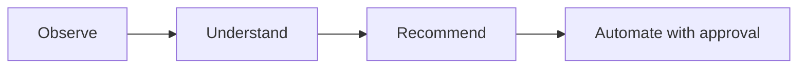

# Roadmap

## Shipped

- Python CLI application, configuration management
- Hardware, OS, storage, and network discovery
- Inventory generation and reporting
- Docker discovery and known-service detection ([Service Catalog](service-catalog.md))
- Docker Compose analysis
- Event-driven system with persistent operational history
- Plugin architecture (currently: a Docker plugin)
- **Proxmox integration** — node discovery, cluster-wide VM/container inventory, API token authentication
- **AI analysis engine** — `atlas analyze`, pluggable Anthropic/Ollama providers, structured recommendations
- Test suite (59+ tests) and CI (GitHub Actions, Python 3.11/3.12)
- **Plugin discovery now feeds the shared store** — `atlas discover-plugins` results persist into the same environment context, knowledge store, and event bus as `atlas discover` and `atlas proxmox scan`, so `atlas analyze` sees plugin-sourced data too

## In progress / next

- **Automation framework** — turning `atlas analyze` recommendations into approval-gated actions, consistent with the project's Safety principle (observable, logged, reversible, approval-gated — see [Deployment](deployment/index.md))
- **Merging discovery into one command** — `atlas discover` and `atlas discover-plugins` still have to be run separately; they share a store now, but not a single discovery pass
- **Proxmox resource trending / change detection** — the current inventory is a point-in-time snapshot; historical tracking needs time-series storage, not just the existing snapshot table
- Advanced monitoring integrations (Prometheus/Grafana-style metrics feeding into the knowledge store)
- Agent-based capabilities

## Guiding principle

Every step up this list is expected to remain consistent with Atlas's core loop:

Automation is the last step, not the first — Atlas earns the right to act by first being reliably right about what it observes and recommends.
