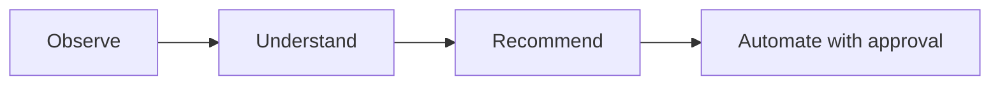

# Roadmap

## Shipped

- [x] Python CLI application, configuration management
- [x] Hardware, OS, storage, and network discovery
- [x] Inventory generation and reporting
- [x] Docker discovery and known-service detection ([Service Catalog](service-catalog.md))
- [x] Docker Compose analysis
- [x] Event-driven system with persistent operational history
- [x] Plugin architecture (currently: a Docker plugin)
- [x] **Proxmox integration** — node discovery, cluster-wide VM/container inventory, API token authentication
- [x] **AI analysis engine** — `atlas analyze`, pluggable Anthropic/Ollama providers, structured recommendations
- [x] Test suite (156 tests) and CI (GitHub Actions, Python 3.11/3.12)
- [x] **Unified discovery** — `atlas discover` now runs built-in discovery and every registered plugin in one pass, saving one complete environment snapshot; the separate `atlas discover-plugins` command was removed once its job was folded in
- [x] **First automation action** — `atlas restart <name>` restarts a Docker container after showing its state and requiring confirmation, logged via the event bus. The first Atlas command that acts rather than observes — see [Architecture](architecture/index.md#approval-gated-actions). Along the way, found and fixed a real bug: the event bus's knowledge-store listener was defined but never actually registered, so no published event had ever been persisted (`atlas history` was effectively non-functional before this).
- [x] **`atlas analyze` suggests actions** — recommendations carry a schema-validated, optional `action` field (currently just `restart_container`); `AtlasAnalyzer` cross-checks the suggested target against containers Atlas actually observed and drops anything ungrounded before it's shown. `atlas analyze` only prints the suggestion (`→ Suggested: atlas restart plex`) — running it is a separate step through `atlas restart`'s own approval gate, not something `analyze` executes itself.
- [x] **Proxmox change detection** — `atlas proxmox scan` now reports what changed since the last scan (nodes/guests added, removed, or status-changed) and logs it via `atlas.proxmox.changes_detected`. This turned out not to need new storage: `save_environment()` was already insert-only, so a full history of past snapshots already existed in the database — this item was mis-scoped before it was actually looked into, the same way the event-listener registration gap was.
- [x] **Monitoring integration** — `atlas monitor` queries an existing Prometheus server for host CPU/memory/disk usage via standard `node_exporter` metrics, following the same "Atlas reaches out on command" shape as every other integration rather than exposing a `/metrics` endpoint. Disabled by default; verified against a real Prometheus + `node_exporter` — see [Architecture](architecture/index.md#monitoring) and "Verification against real infrastructure" below.
- [x] **Fixed: database tables were never created automatically.** `atlas.database.initialize_database()` existed but nothing called it, and the (then still committed) `inventory/atlas.db` predated the `AnalysisRecord` model — so `atlas analyze` would crash on its very first real use (`no such table: analysis`), and a genuinely fresh install with no pre-existing db would crash on *any* command that touches the database. Fixed by calling `initialize_database()` lazily at the top of every `KnowledgeStore`/`KnowledgeQueries` method rather than at construction time — construction happens as part of the `AtlasRuntime` singleton built at module import, so doing it there would create/mutate the database using whatever the process's cwd happens to be at first import (e.g. the real repo root during a `pytest` run), not the user's actual working directory. Verified against a copy of the (then still committed) db (existing rows untouched, missing table added) and against a fresh directory with no `inventory/` at all.
- [x] **`inventory/atlas.db` un-tracked from git.** It grows a new row on every command run and now self-heals its own schema (above), so there was nothing left it needed to seed — keeping it committed just meant every real usage session against real hardware would show up as a binary diff to commit. It's gitignored now; the file still exists locally and nothing about its behavior changed.
- [x] **`atlas doctor` readiness checks** — now also checks the three integrations that were previously invisible to it: Proxmox (enabled + host + credentials present), the AI provider (`ANTHROPIC_API_KEY` set for Anthropic; no key needed for Ollama), and Prometheus (enabled + URL present). These are config/presence checks, not live connection attempts — `doctor` stays fast and never hangs waiting on a network call. A disabled integration reports healthy (`✓ Proxmox: disabled`) since that's a valid, intentional state, not a problem; only "enabled but misconfigured" reports unhealthy. This is what actually answers "is this ready for my real setup" from the command line instead of by hand.
- [x] **Second automation action: `atlas proxmox restart <vmid>`** — restarts a Proxmox VM or LXC guest, the same approval-gated shape as `atlas restart` for Docker (pure result-dict manager function, unconditional `typer.confirm()`, logged via the event bus). This forced the action framework's first real generalization, previously only ever exercised with one action type: `ANALYSIS_SCHEMA`'s `action.type` enum, `AtlasAnalyzer`'s target-grounding check, and `analyze()`'s suggested-command print all moved from a single hardcoded case to small lookup dicts (`TARGET_VALIDATORS`, `action_commands`) keyed by action type — see [Architecture](architecture/index.md#approval-gated-actions). Needs write/power-management permission on the Proxmox token beyond the read-only scope `scan` uses. Along the way, found and fixed two more real bugs in the database-initialization fix from the previous entry (see git history / CLAUDE.md for the full detail).
- [x] **`atlas init`** — interactively generates `atlas.yaml`, prompting only for what actually varies per deployment (instance name, Proxmox, AI provider, Prometheus) and leaving `discovery`/`inventory` at their defaults. `ANTHROPIC_API_KEY` is never prompted for or written. Every run is logged to `logs/atlas-init-<timestamp>.log`, with secret values deliberately excluded from the log even though they're written to `atlas.yaml` itself. Existing `atlas.yaml` is protected behind the same `typer.confirm()` overwrite gate every other mutating command uses.
- [x] **Verification against real infrastructure** — Proxmox, both AI providers (Anthropic/Ollama), and Prometheus checked off integration-by-integration against real live systems, distinct from "built and unit-tested":
  - [x] Proxmox discovery and restart — real Proxmox VE host, real LXC guest
  - [x] Ollama — real local instance, full end-to-end `atlas analyze` run
  - [x] Prometheus — real Prometheus + `node_exporter`
  - [ ] Anthropic — auth + error-handling path confirmed against a real key; a fully successful (non-error) response is still blocked on adding billing credits, a deliberate deferral rather than a technical gap
- [x] **Broader automation framework: `atlas stop <name>` and a real `atlas/actions/` registry** — a third action type (Docker container stop), the one that actually forced `ActionDefinition`/`ACTIONS` to generalize into a real registry instead of three separately-maintained lookup structures.
- [x] **Monitoring threshold/alerting** — configurable per-metric thresholds (`90.0` default), yellow `!` flagging, `atlas.monitoring.threshold_exceeded` published only when something actually crossed. No push notifications (email/Slack/etc.) by design — see "Deliberately out of scope" below.
- [x] **Deeper monitoring: cAdvisor container metrics and Proxmox-style change detection** — per-container CPU/memory via cAdvisor as a second Prometheus exporter, plus `diff_monitoring()` change detection mirroring the Proxmox pattern. Verified against a real cAdvisor instance.
- [x] **Agent-based capabilities: tool-use + `atlas chat`** — both AI providers can call a small, deliberately read-only set of tools mid-request; no mutating tool exists here by design — see "Deliberately out of scope" below. Unlocks `atlas chat`, a multi-turn command that grounds against live state instead of a saved snapshot. Verified against a real local Ollama, including a real bug found only by running against a live model (Ollama silently never called a tool when `tools` and `format` were sent together — fixed by splitting into a tools-only gathering phase then a separate finalize request).
- [x] **Container resource-allocation visibility** — `cpu_percent_of_limit`/`memory_percent_of_limit` via two more cAdvisor PromQL queries, no new Docker-side collection needed. Verified against a real resource-constrained test container.
- [x] **The `resize_container` action** — a fourth action type, the first needing more than a flat `{target}` substitution (`command_template` became a small callable). Found a real, significant course-correction only by resizing an actual live container: `docker run --cpus` sets `NanoCpus`, which docker-py's `update_container()` doesn't expose at all — fixed by posting the raw Engine API request directly through docker-py's own transport.
- [x] **Multi-step action plans** — `AnalysisResult`/`ChatReply` can carry an ordered `plan` of dependent steps, still suggest-only at this point. Grounding treats a plan as one unit — one hallucinated step target drops the whole plan.
- [x] **Persist `atlas chat` transcripts** — one `atlas.chat.transcript_saved` event per session, riding the existing event-log path, no new table.
- [x] **`get_container_logs` tool** — read-only, server-side capped at 500 lines. Found and fixed a real gap along the way: tool handlers never actually received call arguments until this forced the fix (every prior tool got away with it by using an empty schema).
- [x] **Resource-usage trending (`atlas trends`)** — new query/reporting code over data that was already being saved (`save_environment()` is insert-only), not new storage. Explicitly skips rows missing the field being trended, since each command only ever populates the categories it collects.
- [x] **Proxmox stop/resize parity** — `atlas proxmox stop`/`resize` close the gap between Docker's three actions and Proxmox's one, through the same registry pattern. QEMU's hotplug-for-live-memory-resize caveat has since been independently verified against a real QEMU VM (see below).
- [x] **Plan execution** — `atlas analyze`/`atlas chat` can now run a printed plan step-by-step, each with its own confirmation, via a generic `execute_action()` dispatcher. Narrower than originally scoped: no plan persistence, no `atlas plan run` command — the plan already exists in memory the moment it's printed.
- [x] **`--json` output + cron-friendly exit codes** — `atlas doctor`/`atlas monitor`/`atlas trends` gained `--json`; exit codes are meaningful all the time, not just in JSON mode, so a plain cron job can check `$?` with no parsing at all.
- [x] **QEMU VM resize/hotplug caveat, verified** — confirmed against a real QEMU VM via Proxmox's own `pending` API, including a real gotcha the original caveat didn't anticipate (enabling `hotplug: memory` on an already-running VM doesn't retroactively grant live-resize capability).
- [x] **Second-distro verification** — found the project's real day-to-day dev/test platform was Fedora all along, not Ubuntu as previously (incorrectly) documented; corrected. Ubuntu is verified via CI, Fedora via every piece of real-infrastructure testing in this project's history.
- [x] **Proxmox guest usage in `atlas trends`** — the last item deferred when trending shipped. Reused the exact same "skip rows lacking the field" pattern already built for the monitor-vs-discover split; needed zero new machinery.
- [x] **A lightweight read-only web view (`atlas web`)** — a local overview/history/trends dashboard, `http.server` only (no new dependency). Every route is a `GET`; the handler defines no `do_POST`/`do_PUT`/`do_DELETE` at all, so there's no write path reachable by construction, not just by convention. `atlas trends`'s JSON-payload logic was extracted into a new pure `build_trends_payload()` (`atlas/reporting/trends.py`) so the CLI's `--json` output and this page can never disagree — a real, small refactor forced by wanting one source of truth, not two parallel implementations. Verified against a real running server (not just mocks): started `atlas web` for real, seeded real environment/event data, and confirmed all three routes rendered correctly over real HTTP requests, including a real 404 on an unknown route.

## Next

- [ ] **A fully successful (non-error) Anthropic `atlas analyze` response** — blocked on adding API billing credits, not on any code gap. Auth and error-handling are already verified against a real key.
- [ ] **A fifth+ action type** — the registry (`ActionDefinition` + `ACTIONS`) is already built to make this cheap (one entry, one manager function, one CLI command, one prompt sentence); nothing concrete is queued yet.
- [ ] **A second plugin beyond Docker** — the plugin architecture (`AtlasPlugin` ABC, `PluginManager`) has only ever had one real implementation. A natural next candidate is whatever the next non-Docker resource type turns out to be (e.g. a bare-metal service manager, or another hypervisor); nothing is scoped yet.
- [ ] **Multi-node / fleet view** — Atlas currently reasons about one host plus one Proxmox cluster per run. Aggregating history/state across multiple independent Atlas installs (e.g. several homelab nodes) isn't supported and hasn't been scoped.

## Deliberately out of scope

Recorded so these don't get relitigated as "gaps" — each was considered and rejected for a real reason, not overlooked.

- **No daemon / scheduled mode.** Every command is on-demand, run by a human or cron, not a background process. Keeps the "reaches out on command" shape consistent across every integration and avoids Atlas silently acting while unattended. `atlas web` doesn't break this: a human explicitly starts it in a foreground terminal and stops it with `Ctrl+C`, the same on-demand shape as `atlas chat` — nothing runs unattended or gets auto-started.
- **No push notifications (email/Slack/etc.).** "Alerting" means visibly flagged in a command's own output (`!` markers, non-zero exit codes for cron), not paging someone. Atlas has no background process to send a notification *from* — see "no daemon" above; revisit only if a daemon mode is ever actually built.
- **No mutating tool inside `atlas chat`/`atlas analyze`'s tool-use loop.** The AI can observe (read containers/services/events/logs/metrics) but never restart/stop/resize mid-conversation — every mutating action stays behind its own standalone, approval-gated command, never reachable as a side effect of a chat turn.
- **No unattended automation.** Every action (`restart`/`stop`/`resize`, single or as part of a plan) requires an explicit `typer.confirm()` with no bypass flag. There is no "auto-approve" mode, and none is planned — this is the core safety property the "Guiding principle" diagram below encodes.

## Guiding principle

Every step up this list is expected to remain consistent with Atlas's core loop:

Automation is the last step, not the first — Atlas earns the right to act by first being reliably right about what it observes and recommends.
