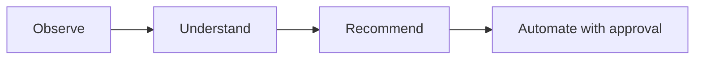

# Roadmap

## Shipped

- Python CLI application, configuration management
- Hardware, OS, storage, and network discovery
- Inventory generation and reporting
- Docker discovery and known-service detection ([Service Catalog](service-catalog.md))
- Docker Compose analysis
- Event-driven system with persistent operational history
- Plugin architecture (currently: a Docker plugin)
- **Proxmox integration** — node discovery, cluster-wide VM/container inventory, API token authentication
- **AI analysis engine** — `atlas analyze`, pluggable Anthropic/Ollama providers, structured recommendations
- Test suite (156 tests) and CI (GitHub Actions, Python 3.11/3.12)
- **Unified discovery** — `atlas discover` now runs built-in discovery and every registered plugin in one pass, saving one complete environment snapshot; the separate `atlas discover-plugins` command was removed once its job was folded in
- **First automation action** — `atlas restart <name>` restarts a Docker container after showing its state and requiring confirmation, logged via the event bus. The first Atlas command that acts rather than observes — see [Architecture](architecture/index.md#approval-gated-actions). Along the way, found and fixed a real bug: the event bus's knowledge-store listener was defined but never actually registered, so no published event had ever been persisted (`atlas history` was effectively non-functional before this).
- **`atlas analyze` suggests actions** — recommendations carry a schema-validated, optional `action` field (currently just `restart_container`); `AtlasAnalyzer` cross-checks the suggested target against containers Atlas actually observed and drops anything ungrounded before it's shown. `atlas analyze` only prints the suggestion (`→ Suggested: atlas restart plex`) — running it is a separate step through `atlas restart`'s own approval gate, not something `analyze` executes itself.
- **Proxmox change detection** — `atlas proxmox scan` now reports what changed since the last scan (nodes/guests added, removed, or status-changed) and logs it via `atlas.proxmox.changes_detected`. This turned out not to need new storage: `save_environment()` was already insert-only, so a full history of past snapshots already existed in the database — this item was mis-scoped before it was actually looked into, the same way the event-listener registration gap was.
- **Monitoring integration** — `atlas monitor` queries an existing Prometheus server for host CPU/memory/disk usage via standard `node_exporter` metrics, following the same "Atlas reaches out on command" shape as every other integration rather than exposing a `/metrics` endpoint. Disabled by default; verified against a real Prometheus + `node_exporter` — see [Architecture](architecture/index.md#monitoring) and "Verification against real infrastructure" below.
- **Fixed: database tables were never created automatically.** `atlas.database.initialize_database()` existed but nothing called it, and the (then still committed) `inventory/atlas.db` predated the `AnalysisRecord` model — so `atlas analyze` would crash on its very first real use (`no such table: analysis`), and a genuinely fresh install with no pre-existing db would crash on *any* command that touches the database. Fixed by calling `initialize_database()` lazily at the top of every `KnowledgeStore`/`KnowledgeQueries` method rather than at construction time — construction happens as part of the `AtlasRuntime` singleton built at module import, so doing it there would create/mutate the database using whatever the process's cwd happens to be at first import (e.g. the real repo root during a `pytest` run), not the user's actual working directory. Verified against a copy of the (then still committed) db (existing rows untouched, missing table added) and against a fresh directory with no `inventory/` at all.
- **`inventory/atlas.db` un-tracked from git.** It grows a new row on every command run and now self-heals its own schema (above), so there was nothing left it needed to seed — keeping it committed just meant every real usage session against real hardware would show up as a binary diff to commit. It's gitignored now; the file still exists locally and nothing about its behavior changed.
- **`atlas doctor` readiness checks** — now also checks the three integrations that were previously invisible to it: Proxmox (enabled + host + credentials present), the AI provider (`ANTHROPIC_API_KEY` set for Anthropic; no key needed for Ollama), and Prometheus (enabled + URL present). These are config/presence checks, not live connection attempts — `doctor` stays fast and never hangs waiting on a network call. A disabled integration reports healthy (`✓ Proxmox: disabled`) since that's a valid, intentional state, not a problem; only "enabled but misconfigured" reports unhealthy. This is what actually answers "is this ready for my real setup" from the command line instead of by hand.
- **Second automation action: `atlas proxmox restart <vmid>`** — restarts a Proxmox VM or LXC guest, the same approval-gated shape as `atlas restart` for Docker (pure result-dict manager function, unconditional `typer.confirm()`, logged via the event bus). This forced the action framework's first real generalization, previously only ever exercised with one action type: `ANALYSIS_SCHEMA`'s `action.type` enum, `AtlasAnalyzer`'s target-grounding check, and `analyze()`'s suggested-command print all moved from a single hardcoded case to small lookup dicts (`TARGET_VALIDATORS`, `action_commands`) keyed by action type — see [Architecture](architecture/index.md#approval-gated-actions). Needs write/power-management permission on the Proxmox token beyond the read-only scope `scan` uses. Along the way, found and fixed two more real bugs in the database-initialization fix from the previous entry: (1) the directory-creation check compared `engine is None`, which no real call site ever satisfies (`KnowledgeStore`/`KnowledgeQueries` always pass their bound `engine` explicitly) — it never actually ran outside a direct no-argument call, masked until now because every prior manual test happened to run `atlas discover` first, whose unrelated `save_inventory()` creates the same parent directory as a side effect; (2) while writing the regression test, discovered that reusing the real `atlas.database.engine.engine` singleton across an in-process `chdir()` (what pytest's `isolated_cwd` fixture does) silently read/wrote the developer's real local database, since SQLAlchemy resolves a relative sqlite path to absolute once at engine-creation time, not per-connection — a test-safety hazard, not a product bug, but real enough that it needed a dedicated fully-isolated-engine regression test rather than reusing the shared singleton.
- **`atlas init`** — interactively generates `atlas.yaml`, prompting only for what actually varies per deployment (instance name, Proxmox, AI provider, Prometheus) and leaving `discovery`/`inventory` at their defaults. `ANTHROPIC_API_KEY` is never prompted for or written, same as before. Every run is logged to `logs/atlas-init-<timestamp>.log` for troubleshooting and record-keeping, with secret values (Proxmox token/password) deliberately excluded from the log even though they're written to `atlas.yaml` itself — a log is more likely to end up pasted into a troubleshooting thread than the gitignored config file is. Existing `atlas.yaml` is protected behind the same `typer.confirm()` overwrite gate every other mutating command uses. Also replaces the stray, unused `atlas/config/config.yaml` template that nothing ever read. Found along the way: the real local `atlas.yaml` had its instance name nested under a stray `atlas:` key `AtlasConfig` doesn't define, which pydantic silently ignored — the name had been quietly falling back to the default the whole time; not worth hand-patching, a fresh `atlas init` run just produces a correctly-shaped file going forward.
- **Verification against real infrastructure.** Proxmox, both AI providers (Anthropic/Ollama), and Prometheus are real, tested code — but every test up to this point had been against mocks, never the actual live systems, since none existed in the development environment. Checked off integration-by-integration as each was actually run against real hardware, distinct from "built and unit-tested":
  - ✅ **Proxmox discovery and restart** — `atlas proxmox scan` run against a real Proxmox VE host, found the real node, then correctly detected a newly-created LXC guest as an addition on the next scan. `atlas proxmox restart` then successfully restarted that real guest — the second action type (after Docker) confirmed working end to end, not just against mocks. Two real-world setup gotchas surfaced getting there, neither an Atlas bug: (1) `verify_ssl: true` fails against Proxmox's default self-signed certificate — needs `false` unless you've replaced the cert; (2) a `403 Permission check failed (.../VM.PowerMgmt)` even after granting `PVEVMUser` came from the API token's **Privilege Separation** setting (on by default) — permissions granted to the *user* (`atlas@pve`) don't apply to the *token* (`atlas@pve!atlas-token`) while separation is on, so grants have to target the token specifically, or Privilege Separation has to be turned off for that token. Called out explicitly in the deployment docs so the next person doesn't have to rediscover it.
  - ◐ **Anthropic** — `atlas analyze` run against a real `ANTHROPIC_API_KEY` for the first time: connection and authentication both succeeded, and a real API error (insufficient credit balance) came back and was handled cleanly via `AIProviderError` — printed a readable message, no crash, no raw traceback. The request/response/error-handling path is genuinely verified; a full successful analysis is not yet, since that's blocked on adding billing credits, a deliberate choice deferred for now rather than a technical gap.
  - ✅ **Ollama** — `atlas analyze` run against a real local Ollama instance for the first time and completed end-to-end: real model call, structured output parsed correctly, summary printed. First fully-successful (not just error-path) `atlas analyze` run of any provider. Its "nothing to report, no VMs present" summary was accurate given what was actually saved at the time (`system`/`hardware`/`containers` still empty since the last save was a Proxmox scan, not a discover) — not a bug, a correct read of thin input data.
  - ✅ **Prometheus** — `atlas monitor` run against a real Prometheus + `node_exporter` (Docker, host networking) for the first time: all three default queries (`CPU_QUERY`/`MEMORY_QUERY`/`DISK_QUERY`) resolved against real metric names and returned real values, `atlas doctor` correctly showed it configured, the full scan→save→print path worked end to end. This was the last checklist item — every integration is now verified against real infrastructure except a fully successful Anthropic response, deliberately deferred (see above).
- **Broader automation framework: `atlas stop <name>` and a real `atlas/actions/` registry** — a third action type (Docker container stop, without removal), picked specifically because it's a different *verb* from the two existing "restart" actions, not just a third resource type doing the same thing — that's what actually forces the registry to generalize rather than just grow. `atlas/actions/registry.py`'s `ActionDefinition` (`type`, `command_template`, `known_targets`) and the `ACTIONS` dict replace what used to be three separately-maintained things: `TARGET_VALIDATORS` in the analyzer, `action_commands` in the CLI, and a hand-written enum in `ANALYSIS_SCHEMA` (now `list(ACTIONS.keys())`, generated rather than duplicated). Still deliberately just a dataclass + dict — three entries doesn't justify a class hierarchy or plugin loader. See [Architecture](architecture/index.md#approval-gated-actions). A fourth action now costs one `ACTIONS` entry, one manager function, one CLI command, and one `SYSTEM_PROMPT` sentence.
- **Monitoring threshold/alerting** — `atlas monitor` now flags each metric against a configurable threshold (`monitoring.cpu_threshold`/`memory_threshold`/`disk_threshold`, `90.0` by default each — reusing the same number `atlas/health/checks.py` already uses for the local host's own memory/storage checks). A metric at or above its threshold prints with a yellow `!` instead of green `✓`, mirroring `atlas doctor`'s existing convention, and `atlas.monitoring.threshold_exceeded` publishes only when something actually crossed — same "don't log a no-op" rule Proxmox change detection follows. No push notifications (email/Slack/etc.) — Atlas has no background process to send them from, consistent with the "reaches out on command" shape every integration follows; alerting means "visibly flagged when you run the command," not "pages you." Verified against the same real Prometheus + `node_exporter` from the verification milestone above, both the normal and threshold-exceeded paths.

- **Deeper monitoring: cAdvisor container metrics and Proxmox-style change detection** — `atlas monitor` now also reports per-container CPU (percent of one core) and memory (percent of host total memory) via cAdvisor, treated as a second exporter on the same Prometheus rather than a new integration — no new config section, just two more PromQL queries. Required a small refactor first: `query_prometheus()` only ever returned a single scalar, which doesn't fit a query returning one row per container, so the shared request/parse logic moved into a private `_query()` and a new `query_prometheus_vector()` returns `{label_value: value}` for every row. Also closes the other half of this roadmap item — monitoring data is now wired into the same change-detection pattern Proxmox scan uses (`atlas/monitoring/changes.py`'s `diff_monitoring()`, mirroring `diff_virtualization()`'s shape): a metric (host or per-container) crossing or recovering from its threshold since the last scan prints a "Changes since last scan" section and publishes `atlas.monitoring.changes_detected` — distinct from the existing `atlas.monitoring.threshold_exceeded`, which fires on "something is bad right now" every scan rather than "something changed since last time." See [Architecture](architecture/index.md#monitoring). Verified against a real cAdvisor (Docker, host networking, `--privileged`) added as a second scrape job on the same test Prometheus already used for the earlier monitoring verification: real per-container CPU/memory rows returned for all three actual containers on the host, and lowering `cpu_threshold` below the real current CPU usage between two live scans produced a genuine `container_metric_crossed` change and a real `atlas.monitoring.changes_detected` event — while correctly *not* reporting the host CPU metric as "changed," since re-evaluating the previous snapshot under the new threshold showed it was already over, which is exactly the "evaluated against current thresholds both times" behavior the diff function was designed to have.

- **Agent-based capabilities: tool-use + `atlas chat`** — both AI providers can now call a small, deliberately read-only set of tools mid-request (`get_containers`, `get_services`, `get_recent_events`, `get_last_analysis`, plus `get_proxmox_status`/`get_monitoring` when enabled) instead of only ever seeing one fixed snapshot — each tool just wraps a function that already existed, no new data-collection code, and no mutating tool exists here on purpose (restart/stop stay behind their own approval-gated commands). `atlas analyze` uses this by default now — no new config flag, since unlike Prometheus/Proxmox it has no external dependency to gate against. This also unlocks **`atlas chat`**, a new multi-turn command that can suggest an approval-gated action the same grounded way `atlas analyze` does, but never execute one — and unlike `atlas analyze`, needs no prior `atlas discover` since it grounds against live state instead of a saved snapshot. Both stay strictly on-demand, same as every other Atlas command — no daemon, no scheduled mode. See [Architecture](architecture/index.md#agent-based-capabilities).
  - **A real bug only surfaced by actually running this against a live model, not by testing against mocks:** the two providers' tool loops turned out to need genuinely different request shapes. Anthropic's documented pattern sends `tools` and the schema-constrained `output_config.format` in the same request every turn — that's what the initial implementation did for both providers, and it passed every unit test written against a mocked client. Running `atlas chat` against a real local Ollama (`llama3.1`) showed the model silently never calling a tool at all when `format` was present — no error, it just answered directly and ungrounded. Fixed by never sending `tools` and `format` together for Ollama: a tools-only gathering phase until the model stops asking for tools, then one dedicated finalize request for the schema-shaped answer. Re-verified afterward: `atlas chat` correctly called `get_containers` and reported the real, live set of Docker containers running on the host.

- **Container resource-allocation visibility (Phase 1 of resource-allocation recommendations/adjustment)** — `atlas monitor` now reports `cpu_percent_of_limit`/`memory_percent_of_limit` alongside the existing host-relative `cpu_percent`/`memory_percent`, answering "is this container starved relative to what it was actually allocated," not just "is it busy." Deliberately **no Docker-side collection** — the original framing assumed this needed `docker.py`'s `container.attrs["HostConfig"]` cross-referenced against cAdvisor usage, but cAdvisor already exposes the *configured limits themselves* as their own metrics, so this is two more PromQL queries in `collector.py`, computed entirely server-side, with `atlas/docker/manager.py` untouched — another "assumed it needed new infrastructure; it didn't" outcome, after Proxmox's insert-only history and the event-listener registration gap. Threshold-flagging reuses two new `MonitoringConfig` fields, `cpu_allocation_threshold`/`memory_allocation_threshold` (90.0 default, same convention as every other threshold), evaluated via a container-only thresholds dict so the host-level dict stays untouched. `diff_monitoring()`/`evaluate_thresholds()`/`atlas.monitoring.changes_detected` needed zero changes — both are already generic over whatever keys a container's metrics dict contains. See [Architecture](architecture/index.md#monitoring).
  - **Two real bugs, both found only by running against real infrastructure:** (1) the CPU query originally divided an aggregated `sum(...) by (name)` series against un-aggregated `container_spec_cpu_*` series — Prometheus's default vector matching requires identical label sets, and a mismatch silently returns no rows rather than an error, so `cpu_percent_of_limit` came back `None` even for a container with a real configured limit, fixed with explicit `on(name)` matching (the memory query didn't need this — neither side of it is aggregated). (2) found by tracing the display code, not by running it: without the two new allocation-threshold config keys existing under exactly those metric names, `evaluate_thresholds()`'s existing "no configured threshold = not evaluated" rule meant the new metrics would print a real value but *silently never show the yellow `!`*, even at 100% of allocation. Verified end-to-end against a real `--cpus=0.5 --memory=256m` test container: `cpu_percent_of_limit` tracked `cpu_percent / 0.5` exactly across live scans, and lowering `cpu_allocation_threshold` below the real live percentage correctly triggered the `!` flag.
  - **Phase 2: the `resize_container` action** — a fourth `ACTIONS` entry backed by a new `resize_container()` in `atlas/docker/manager.py`, letting the AI suggest — and you execute via a new `atlas resize <name> --cpus/--memory` command — an actual limit change based on what Phase 1 shows. `SuggestedAction` gained the two concrete optional fields scoped ahead of time (`cpus`/`memory`, not a generic `params` dict), now folded into a single shared `ACTION_SCHEMA` both `ANALYSIS_SCHEMA` and `CHAT_SCHEMA` reference by identity rather than duplicating. This was the first action needing more than a flat `{target}` substitution, which forced `ActionDefinition.command_template` to become a small callable (`Callable[[SuggestedAction], str]`) instead of a plain format string — the three older entries are now one-line lambdas, and `resize_container`'s conditionally includes `--cpus`/`--memory` only for whichever dimension was actually proposed, so a partial resize ("just bump memory") stays expressible. See [Architecture](architecture/index.md#approval-gated-actions).
  - **A real, significant course-correction, found only by resizing an actual live container, not by reading docker-py's docs:** `docker run --cpus=0.5` (the standard, common path — including every earlier test container in this project) sets `HostConfig.NanoCpus`, not `CpuPeriod`/`CpuQuota`. The originally-scoped design (`container.update(cpu_period=..., cpu_quota=...)`) failed against a real such container with a genuine `409 Conflict`: `"CPU Period cannot be updated as NanoCPUs has already been set"` — Docker refuses to mix the two CPU-limiting mechanisms on one container. Worse, docker-py's `update_container()` (checked by reading its actual source) has **no `NanoCPUs` parameter at all**, even though the raw Docker Engine API accepts one — confirmed by running the real `docker update --cpus` CLI against the same container, which does set it. Fixed by having `resize_container()` post that raw API request directly via docker-py's own `client.api` (a `requests.Session` subclass with the Docker-socket transport adapter already registered) — `.post()` and `.base_url` are both genuinely public, stable attributes, so this needed no new HTTP dependency and no shell-out to the `docker` CLI binary, which nothing else in this codebase does. Verified end to end afterward: current-state display (correctly reading `NanoCpus` too, a matching fix `get_container_info()` needed for the same reason), a combined CPU+memory resize actually taking effect live (confirmed via `docker inspect` before/after, no restart), and an intentionally-too-low memory value failing cleanly with a caught `400 Bad Request` rather than a crash.

- **Multi-step action plans** — the deferred third option from scoping agent-based capabilities (tool-use + `atlas chat` shipped earlier; this was the remaining piece). `AnalysisResult`/`ChatReply` gained an optional `plan: SuggestedPlan | None` (a summary plus an ordered list of `PlanStep(action, rationale)`) alongside the existing single `action` field, for a genuine ordered sequence where later steps depend on earlier ones — e.g. stop the container holding a lock, then restart the one that was failing because of it. Still suggest-only, same boundary as every action before it: `atlas analyze`/`atlas chat` print the plan as a numbered list with each step's command and rationale; nothing executes it, there's no `atlas plan run`, and no plan persistence (`KnowledgeStore.save_analysis()` still only writes `summary`/`recommendations`). `PLAN_SCHEMA` reuses the same action-object schema each step's action is validated against (pulled out into its own `ACTION_OBJECT_SCHEMA` constant so both stay in sync). Grounding treats a plan as one unit, not independent steps — reusing a shared `is_action_grounded()` helper factored out of `AtlasAnalyzer`/`AtlasAgent` once this made it the third place doing the identical target-grounding check — so one hallucinated step target drops the whole plan rather than leaving a partially-runnable sequence behind. See [Architecture](architecture/index.md#multi-step-action-plans).
  - **A real bug, found only by running a real dependency-chain scenario through a real local Ollama, not by any unit test:** the model filled in both `plan` and the standalone `action` for the same suggestion, `action` being a duplicate of the plan's own first step — which would have printed a redundant "suggested action" line directly on top of the plan repeating its own first line. The prompt was updated to tell the model not to do this, but since a prompt instruction isn't enforcement (the same reasoning behind target grounding), `AtlasAgent.converse()` also now nulls the standalone `action` outright whenever a plan is present. Re-verified against real Ollama afterward with two scenarios: a genuine 3-step dependency chain across two real Docker containers (stop the dependency, restart the dependent, restart the dependency again) came back as a correctly ordered, correctly grounded plan with `action` now `None`; a second scenario with two unrelated, independent container issues correctly stayed as two separate recommendations with `plan` left `None`, confirming the model isn't defaulting to a plan when one isn't warranted.

- **Persist `atlas chat` transcripts** — explicitly left ephemeral when `atlas chat` shipped; now saved as one `atlas.chat.transcript_saved` event per session (on exit, only if the session had at least one exchange), riding the same event-log path `atlas history` already reads — no new table, no new query method, no new command. Built from a second, separate `transcript` list in `chat()`'s CLI loop rather than reusing the `messages` list already passed to `agent.converse()`. That distinction mattered: both providers mutate `messages` in place, and Anthropic's tool-use loop appends raw SDK content-block objects onto it mid-conversation (`response.content`, not a plain dict) — publishing that list directly as an event payload would crash `KnowledgeStore.save_event()`'s plain `json.dumps()` on any session where a tool got called, which is the common case, not an edge case, for a command whose whole point is tool-grounded answers. Found by reading `_run_loop()`, not by hitting the crash. Verified against a real local Ollama: a session that genuinely called `get_containers` mid-conversation exited cleanly, and `atlas history` afterward showed the correct transcript with no serialization error. See [Architecture](architecture/index.md#agent-based-capabilities).

- **`get_container_logs` tool** — a read-only addition to the tool set `atlas analyze`/`atlas chat` already call (`atlas/intelligence/tools.py`), letting the AI pull recent log lines for a specific container instead of reasoning from status alone. Wraps a new `get_container_logs()` in `atlas/docker/manager.py` (same pure-result-dict, never-raises shape as every other manager function there), with the AI able to request how many lines (`tail`), server-side capped at 500 so a runaway request can't dump excessive log volume into the conversation.
  - **A real gap, found by reading the actual code, not assumed:** this was the first tool needing an argument, and it turned out `ToolDefinition.handler` was `Callable[[], dict]` — zero arguments — while `execute_tool(tools, name, arguments)` received real per-call arguments from both providers' tool-use loops (Anthropic's `block.input`, Ollama's `function.get("arguments")`) but never actually passed them to the handler. Every prior tool got away with this because they all used an empty input schema. Fixed by making every handler's signature `Callable[[dict], dict]` uniformly and having `execute_tool()` call `definition.handler(arguments)` — the five pre-existing zero-arg tools just take and ignore `arguments` now, rather than special-casing the one that needs it. No grounding logic needed for the new tool itself: unlike a suggested action, a hallucinated or stale container name just comes back as an ordinary `{"found": False, "error": "..."}` tool result via Docker's existing `NotFound` handling. Verified against a real local Ollama and a real Prometheus test container: asked to check `atlas-test-prometheus`'s logs for problems, the model correctly called `get_container_logs` with the real container name and answered from the actual log content (recognizing genuine Prometheus startup output — debug/info/warning-level lines), not a guess from status alone.

## In progress / next

- **Resource-usage trending over time** — already promised in the repo README's Proxmox section ("planned expansion") but was never actually tracked here. `save_environment()` is insert-only (confirmed while building Proxmox change detection — a full history of past snapshots already exists even though only `latest_environment()` is normally queried), so this is new query/reporting code over data that's already being saved, not new storage.

## Guiding principle

Every step up this list is expected to remain consistent with Atlas's core loop:

Automation is the last step, not the first — Atlas earns the right to act by first being reliably right about what it observes and recommends.
