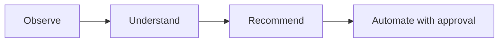

# Roadmap

## Shipped

- Python CLI application, configuration management
- Hardware, OS, storage, and network discovery
- Inventory generation and reporting
- Docker discovery and known-service detection ([Service Catalog](service-catalog.md))
- Docker Compose analysis
- Event-driven system with persistent operational history
- Plugin architecture (currently: a Docker plugin)
- **Proxmox integration** — node discovery, cluster-wide VM/container inventory, API token authentication
- **AI analysis engine** — `atlas analyze`, pluggable Anthropic/Ollama providers, structured recommendations
- Test suite (73 tests) and CI (GitHub Actions, Python 3.11/3.12)
- **Unified discovery** — `atlas discover` now runs built-in discovery and every registered plugin in one pass, saving one complete environment snapshot; the separate `atlas discover-plugins` command was removed once its job was folded in
- **First automation action** — `atlas restart <name>` restarts a Docker container after showing its state and requiring confirmation, logged via the event bus. The first Atlas command that acts rather than observes — see [Architecture](architecture/index.md#approval-gated-actions). Along the way, found and fixed a real bug: the event bus's knowledge-store listener was defined but never actually registered, so no published event had ever been persisted (`atlas history` was effectively non-functional before this).

## In progress / next

- **Broader automation framework** — a real action registry, and wiring `atlas analyze`'s AI-generated recommendations to *suggest* specific actions (recommendations are free text today; mapping them to structured, executable actions is still open). One narrow action exists; a framework generalized from it doesn't yet.
- **Proxmox resource trending / change detection** — the current inventory is a point-in-time snapshot; historical tracking needs time-series storage, not just the existing snapshot table
- Advanced monitoring integrations (Prometheus/Grafana-style metrics feeding into the knowledge store)
- Agent-based capabilities

## Guiding principle

Every step up this list is expected to remain consistent with Atlas's core loop:

Automation is the last step, not the first — Atlas earns the right to act by first being reliably right about what it observes and recommends.
