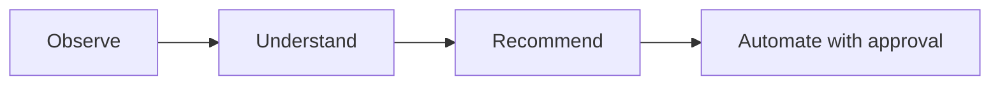

# Roadmap

## Shipped

- Python CLI application, configuration management
- Hardware, OS, storage, and network discovery
- Inventory generation and reporting
- Docker discovery and known-service detection ([Service Catalog](service-catalog.md))
- Docker Compose analysis
- Event-driven system with persistent operational history
- Plugin architecture (currently: a Docker plugin)
- **Proxmox integration** — node discovery, cluster-wide VM/container inventory, API token authentication
- **AI analysis engine** — `atlas analyze`, pluggable Anthropic/Ollama providers, structured recommendations
- Test suite (134 tests) and CI (GitHub Actions, Python 3.11/3.12)
- **Unified discovery** — `atlas discover` now runs built-in discovery and every registered plugin in one pass, saving one complete environment snapshot; the separate `atlas discover-plugins` command was removed once its job was folded in
- **First automation action** — `atlas restart <name>` restarts a Docker container after showing its state and requiring confirmation, logged via the event bus. The first Atlas command that acts rather than observes — see [Architecture](architecture/index.md#approval-gated-actions). Along the way, found and fixed a real bug: the event bus's knowledge-store listener was defined but never actually registered, so no published event had ever been persisted (`atlas history` was effectively non-functional before this).
- **`atlas analyze` suggests actions** — recommendations carry a schema-validated, optional `action` field (currently just `restart_container`); `AtlasAnalyzer` cross-checks the suggested target against containers Atlas actually observed and drops anything ungrounded before it's shown. `atlas analyze` only prints the suggestion (`→ Suggested: atlas restart plex`) — running it is a separate step through `atlas restart`'s own approval gate, not something `analyze` executes itself.
- **Proxmox change detection** — `atlas proxmox scan` now reports what changed since the last scan (nodes/guests added, removed, or status-changed) and logs it via `atlas.proxmox.changes_detected`. This turned out not to need new storage: `save_environment()` was already insert-only, so a full history of past snapshots already existed in the database — this item was mis-scoped before it was actually looked into, the same way the event-listener registration gap was.
- **Monitoring integration** — `atlas monitor` queries an existing Prometheus server for host CPU/memory/disk usage via standard `node_exporter` metrics, following the same "Atlas reaches out on command" shape as every other integration rather than exposing a `/metrics` endpoint. Disabled by default; verified against a real Prometheus + `node_exporter` — see [Architecture](architecture/index.md#monitoring) and "Verification against real infrastructure" below.
- **Fixed: database tables were never created automatically.** `atlas.database.initialize_database()` existed but nothing called it, and the (then still committed) `inventory/atlas.db` predated the `AnalysisRecord` model — so `atlas analyze` would crash on its very first real use (`no such table: analysis`), and a genuinely fresh install with no pre-existing db would crash on *any* command that touches the database. Fixed by calling `initialize_database()` lazily at the top of every `KnowledgeStore`/`KnowledgeQueries` method rather than at construction time — construction happens as part of the `AtlasRuntime` singleton built at module import, so doing it there would create/mutate the database using whatever the process's cwd happens to be at first import (e.g. the real repo root during a `pytest` run), not the user's actual working directory. Verified against a copy of the (then still committed) db (existing rows untouched, missing table added) and against a fresh directory with no `inventory/` at all.
- **`inventory/atlas.db` un-tracked from git.** It grows a new row on every command run and now self-heals its own schema (above), so there was nothing left it needed to seed — keeping it committed just meant every real usage session against real hardware would show up as a binary diff to commit. It's gitignored now; the file still exists locally and nothing about its behavior changed.
- **`atlas doctor` readiness checks** — now also checks the three integrations that were previously invisible to it: Proxmox (enabled + host + credentials present), the AI provider (`ANTHROPIC_API_KEY` set for Anthropic; no key needed for Ollama), and Prometheus (enabled + URL present). These are config/presence checks, not live connection attempts — `doctor` stays fast and never hangs waiting on a network call. A disabled integration reports healthy (`✓ Proxmox: disabled`) since that's a valid, intentional state, not a problem; only "enabled but misconfigured" reports unhealthy. This is what actually answers "is this ready for my real setup" from the command line instead of by hand.
- **Second automation action: `atlas proxmox restart <vmid>`** — restarts a Proxmox VM or LXC guest, the same approval-gated shape as `atlas restart` for Docker (pure result-dict manager function, unconditional `typer.confirm()`, logged via the event bus). This forced the action framework's first real generalization, previously only ever exercised with one action type: `ANALYSIS_SCHEMA`'s `action.type` enum, `AtlasAnalyzer`'s target-grounding check, and `analyze()`'s suggested-command print all moved from a single hardcoded case to small lookup dicts (`TARGET_VALIDATORS`, `action_commands`) keyed by action type — see [Architecture](architecture/index.md#approval-gated-actions). Needs write/power-management permission on the Proxmox token beyond the read-only scope `scan` uses. Along the way, found and fixed two more real bugs in the database-initialization fix from the previous entry: (1) the directory-creation check compared `engine is None`, which no real call site ever satisfies (`KnowledgeStore`/`KnowledgeQueries` always pass their bound `engine` explicitly) — it never actually ran outside a direct no-argument call, masked until now because every prior manual test happened to run `atlas discover` first, whose unrelated `save_inventory()` creates the same parent directory as a side effect; (2) while writing the regression test, discovered that reusing the real `atlas.database.engine.engine` singleton across an in-process `chdir()` (what pytest's `isolated_cwd` fixture does) silently read/wrote the developer's real local database, since SQLAlchemy resolves a relative sqlite path to absolute once at engine-creation time, not per-connection — a test-safety hazard, not a product bug, but real enough that it needed a dedicated fully-isolated-engine regression test rather than reusing the shared singleton.
- **`atlas init`** — interactively generates `atlas.yaml`, prompting only for what actually varies per deployment (instance name, Proxmox, AI provider, Prometheus) and leaving `discovery`/`inventory` at their defaults. `ANTHROPIC_API_KEY` is never prompted for or written, same as before. Every run is logged to `logs/atlas-init-<timestamp>.log` for troubleshooting and record-keeping, with secret values (Proxmox token/password) deliberately excluded from the log even though they're written to `atlas.yaml` itself — a log is more likely to end up pasted into a troubleshooting thread than the gitignored config file is. Existing `atlas.yaml` is protected behind the same `typer.confirm()` overwrite gate every other mutating command uses. Also replaces the stray, unused `atlas/config/config.yaml` template that nothing ever read. Found along the way: the real local `atlas.yaml` had its instance name nested under a stray `atlas:` key `AtlasConfig` doesn't define, which pydantic silently ignored — the name had been quietly falling back to the default the whole time; not worth hand-patching, a fresh `atlas init` run just produces a correctly-shaped file going forward.

## In progress / next

- **Verification against real infrastructure.** Proxmox, both AI providers (Anthropic/Ollama), and Prometheus are real, tested code — but every test so far had been against mocks, never the actual live systems, since none existed in the development environment. This is tracked as its own milestone rather than left implicit: checked off integration-by-integration as each is actually run against real hardware, distinct from "built and unit-tested." `atlas doctor`'s readiness checks confirm config is *present*, not that the target is actually reachable — that's what this milestone covers.
  - ✅ **Proxmox discovery and restart** — `atlas proxmox scan` run against a real Proxmox VE host, found the real node, then correctly detected a newly-created LXC guest as an addition on the next scan. `atlas proxmox restart` then successfully restarted that real guest — the second action type (after Docker) confirmed working end to end, not just against mocks. Two real-world setup gotchas surfaced getting there, neither an Atlas bug: (1) `verify_ssl: true` fails against Proxmox's default self-signed certificate — needs `false` unless you've replaced the cert; (2) a `403 Permission check failed (.../VM.PowerMgmt)` even after granting `PVEVMUser` came from the API token's **Privilege Separation** setting (on by default) — permissions granted to the *user* (`atlas@pve`) don't apply to the *token* (`atlas@pve!atlas-token`) while separation is on, so grants have to target the token specifically, or Privilege Separation has to be turned off for that token. Worth calling out explicitly in the deployment docs so the next person doesn't have to rediscover it.
  - ◐ **Anthropic** — `atlas analyze` run against a real `ANTHROPIC_API_KEY` for the first time: connection and authentication both succeeded, and a real API error (insufficient credit balance) came back and was handled cleanly via `AIProviderError` — printed a readable message, no crash, no raw traceback. The request/response/error-handling path is genuinely verified; a full successful analysis is not yet, since that's blocked on adding billing credits, a deliberate choice deferred for now rather than a technical gap.
  - ✅ **Ollama** — `atlas analyze` run against a real local Ollama instance for the first time and completed end-to-end: real model call, structured output parsed correctly, summary printed. First fully-successful (not just error-path) `atlas analyze` run of any provider. Its "nothing to report, no VMs present" summary was accurate given what was actually saved at the time (`system`/`hardware`/`containers` still empty since the last save was a Proxmox scan, not a discover) — not a bug, a correct read of thin input data.
  - ✅ **Prometheus** — `atlas monitor` run against a real Prometheus + `node_exporter` (Docker, host networking) for the first time: all three default queries (`CPU_QUERY`/`MEMORY_QUERY`/`DISK_QUERY`) resolved against real metric names and returned real values, `atlas doctor` correctly showed it configured, the full scan→save→print path worked end to end. This was the last checklist item — every integration is now verified against real infrastructure except a fully successful Anthropic response, deliberately deferred (see above).
- **Broader automation framework** — the action *registry* is real now (two dicts, above), but there's still no generic `atlas/actions/` framework where an action is its own pluggable unit; each action is still its own CLI command plus its own manager module, by convention rather than structure. A third action (container removal, VM start/stop, etc.) is what would force that next layer.
- **Deeper monitoring** — container-level metrics (cAdvisor), threshold/alerting on the metrics `atlas monitor` already collects, and wiring monitoring data into the change-detection pattern built for Proxmox. All deferred until there's a real Prometheus to validate against.
- Agent-based capabilities

## Guiding principle

Every step up this list is expected to remain consistent with Atlas's core loop:

Automation is the last step, not the first — Atlas earns the right to act by first being reliably right about what it observes and recommends.
