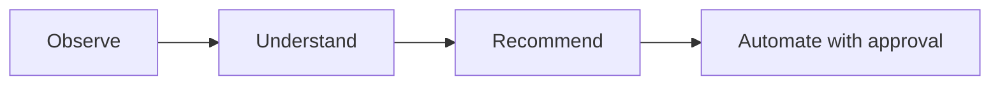

# Roadmap

## Shipped

- Python CLI application, configuration management
- Hardware, OS, storage, and network discovery
- Inventory generation and reporting
- Docker discovery and known-service detection ([Service Catalog](service-catalog.md))
- Docker Compose analysis
- Event-driven system with persistent operational history
- Plugin architecture (currently: a Docker plugin)
- **Proxmox integration** — node discovery, cluster-wide VM/container inventory, API token authentication
- **AI analysis engine** — `atlas analyze`, pluggable Anthropic/Ollama providers, structured recommendations
- Test suite (101 tests) and CI (GitHub Actions, Python 3.11/3.12)
- **Unified discovery** — `atlas discover` now runs built-in discovery and every registered plugin in one pass, saving one complete environment snapshot; the separate `atlas discover-plugins` command was removed once its job was folded in
- **First automation action** — `atlas restart <name>` restarts a Docker container after showing its state and requiring confirmation, logged via the event bus. The first Atlas command that acts rather than observes — see [Architecture](architecture/index.md#approval-gated-actions). Along the way, found and fixed a real bug: the event bus's knowledge-store listener was defined but never actually registered, so no published event had ever been persisted (`atlas history` was effectively non-functional before this).
- **`atlas analyze` suggests actions** — recommendations carry a schema-validated, optional `action` field (currently just `restart_container`); `AtlasAnalyzer` cross-checks the suggested target against containers Atlas actually observed and drops anything ungrounded before it's shown. `atlas analyze` only prints the suggestion (`→ Suggested: atlas restart plex`) — running it is a separate step through `atlas restart`'s own approval gate, not something `analyze` executes itself.
- **Proxmox change detection** — `atlas proxmox scan` now reports what changed since the last scan (nodes/guests added, removed, or status-changed) and logs it via `atlas.proxmox.changes_detected`. This turned out not to need new storage: `save_environment()` was already insert-only, so a full history of past snapshots already existed in the database — this item was mis-scoped before it was actually looked into, the same way the event-listener registration gap was.
- **Monitoring integration** — `atlas monitor` queries an existing Prometheus server for host CPU/memory/disk usage via standard `node_exporter` metrics, following the same "Atlas reaches out on command" shape as every other integration rather than exposing a `/metrics` endpoint. Disabled by default; built and tested against mocked Prometheus responses, not yet verified against a live Prometheus since none exists in this environment yet — see [Architecture](architecture/index.md#monitoring).
- **Fixed: database tables were never created automatically.** `atlas.database.initialize_database()` existed but nothing called it, and the committed `inventory/atlas.db` predated the `AnalysisRecord` model — so `atlas analyze` would crash on its very first real use (`no such table: analysis`), and a genuinely fresh install with no committed db would crash on *any* command that touches the database. Fixed by calling `initialize_database()` lazily at the top of every `KnowledgeStore`/`KnowledgeQueries` method rather than at construction time — construction happens as part of the `AtlasRuntime` singleton built at module import, so doing it there would create/mutate the database using whatever the process's cwd happens to be at first import (e.g. the real repo root during a `pytest` run), not the user's actual working directory. Verified against a copy of the real committed db (existing rows untouched, missing table added) and against a fresh directory with no `inventory/` at all.

## In progress / next

- **Broader automation framework** — a real action registry covering more than restarts (Proxmox VM control, container removal, etc.), generalized from the one action type that exists today.
- **Deeper monitoring** — container-level metrics (cAdvisor), threshold/alerting on the metrics `atlas monitor` already collects, and wiring monitoring data into the change-detection pattern built for Proxmox. All deferred until there's a real Prometheus to validate against.
- Agent-based capabilities

## Guiding principle

Every step up this list is expected to remain consistent with Atlas's core loop:

Automation is the last step, not the first — Atlas earns the right to act by first being reliably right about what it observes and recommends.
