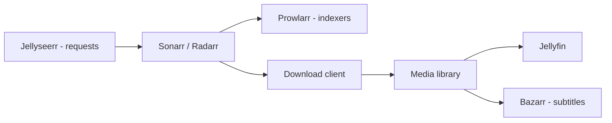

# Service Catalog

`atlas services` matches running Docker container names against a small catalog of known homelab applications, so a container isn't just a name — it's an application with a category and a purpose.

## Currently recognized

This table matches `atlas/services/catalog.py` exactly — the actual list `atlas services` recognizes today, not an aspirational one.

| Service | Category | Purpose |
|---|---|---|
| Jellyfin | Media | Media streaming server |
| Sonarr | Media | TV automation |
| Radarr | Media | Movie automation |
| Prowlarr | Media | Indexer management |
| Bazarr | Media | Subtitle management |
| Jellyseerr | Media | Media requests |
| Portainer | Management | Container management |

Detection is a case-insensitive substring match against the container name — `my-radarr-container` matches `radarr` — so container names don't need to be exact.

## A typical media stack

The catalog's media entries are commonly deployed together:

Atlas doesn't manage this stack — `atlas services` identifies which pieces of it are present and running, which feeds into `atlas analyze`'s recommendations (e.g. flagging a `sonarr` container with no matching `prowlarr`).

## Adding a service

New entries go in `atlas/services/catalog.py`'s `SERVICES` dict — a name, category, and purpose. No detector code changes are needed; `detect_services()` matches against whatever's in the catalog.
